# Understanding the HOC Calculator: A Beginner's Guide to Language Development

## Table of Contents
1. [Introduction to Language Processing](#introduction-to-language-processing)
2. [What is Yacc/Bison?](#what-is-yaccbison)
3. [Architecture Overview](#architecture-overview)
4. [Lexical Analysis: The Lexer](#lexical-analysis-the-lexer)
5. [Syntax Analysis: The Parser](#syntax-analysis-the-parser)
6. [How yyparse Matches Rules: The State Machine](#how-yyparse-matches-rules-the-state-machine)
7. [Expression Evaluation](#expression-evaluation)
8. [Complete Example Walkthrough](#complete-example-walkthrough)
9. [How Values Flow Through the System](#how-values-flow-through-the-system)

---

## Introduction to Language Processing

### What is a Programming Language Processor?

When you write code or mathematical expressions, the computer doesn't understand them directly. A **language processor** translates your human-readable code into actions the computer can perform.

There are two main types:
- **Compilers**: Translate entire programs into machine code before execution
- **Interpreters**: Read and execute code line by line

Our HOC (Higher Order Calculator) is a simple **interpreter** that reads mathematical expressions and evaluates them immediately.

### The Two-Stage Process

Language processing typically happens in two stages:

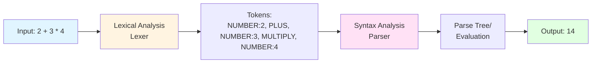

1. **Lexical Analysis (Lexer)**: Breaks input into meaningful pieces called "tokens"
   - Example: `2 + 3` becomes `[NUMBER(2), PLUS, NUMBER(3)]`

2. **Syntax Analysis (Parser)**: Checks if tokens follow language rules and builds a structure
   - Example: Verifies that numbers and operators are in correct order
   - Builds a tree showing operation precedence

---

## What is Yacc/Bison?

**Yacc** (Yet Another Compiler Compiler) is a tool that automatically generates parsers from grammar specifications. You write the **grammar rules**, and Yacc generates the C code for parsing.

### Why Use Yacc?

Writing parsers by hand is complex and error-prone. Yacc:
- ✅ Handles operator precedence automatically
- ✅ Manages complex grammar rules
- ✅ Generates efficient parsing code
- ✅ Handles error recovery

### The Yacc Workflow

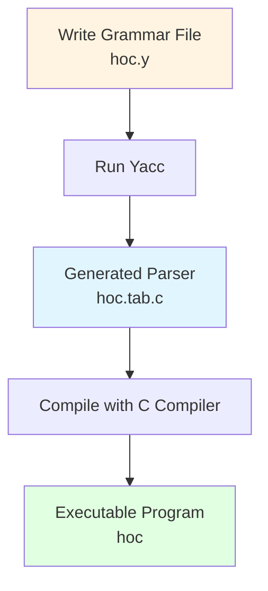

---

## Architecture Overview

### Components of HOC Calculator

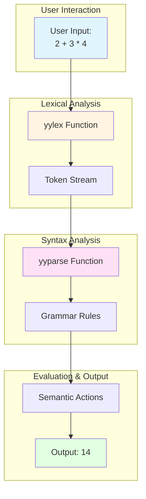

### The Three Key Components

1. **yylex()** - The Lexer (written by programmer)
   - Reads characters from input
   - Groups them into tokens
   - Returns token types to parser

2. **yyparse()** - The Parser (generated by Yacc)
   - Receives tokens from lexer
   - Checks syntax against grammar rules
   - Executes semantic actions (calculations)

3. **Grammar Rules** - The Language Specification
   - Defines what expressions are valid
   - Specifies operator precedence
   - Contains actions for evaluation

---

## Lexical Analysis: The Lexer

### What Does the Lexer Do?

The lexer (`yylex()` function) is like a scanner that reads the input character by character and groups characters into meaningful units called **tokens**.

### Token Types in HOC

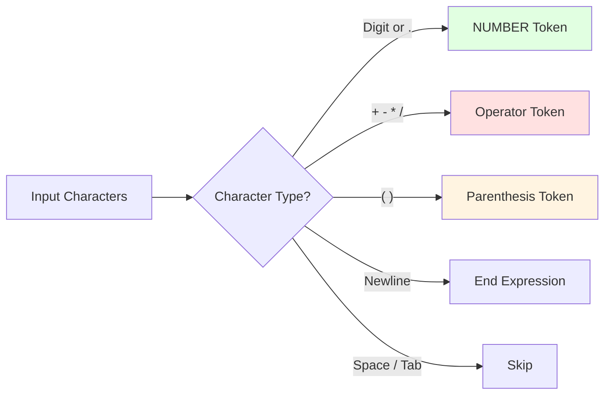

### The yylex() Function Explained

```c
int yylex()
{
    int c;

    // Skip whitespace
    while ((c = getchar()) == ' ' || c == '\t');

    // Check for end of input
    if (c == EOF) return 0;

    // Handle numbers (including decimals like 3.14)
    if (c == '.' || isdigit(c))
    {
        ungetc(c, stdin);      // Put character back
        scanf("%lf", &yylval);  // Read full number into yylval
        return NUMBER;          // Tell parser: "I found a number"
    }

    // Track line numbers for error messages
    if (c == '\n') lineno++;

    // Return operators and parentheses as-is
    return c;  // Returns ASCII value ('+' returns 43, etc.)
}
```

### How yylex() Works - Step by Step

**Example Input**: `2 + 3`

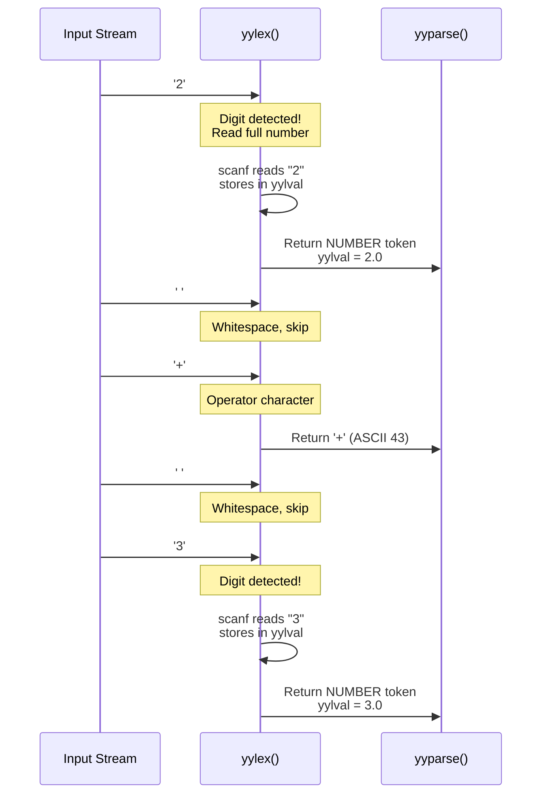

### Key Concepts: yylval

**yylval** is a special global variable that carries the **value** of a token:
- For NUMBER tokens: holds the actual numeric value (2.0, 3.14, etc.)
- For operators: not used (the token type itself is enough)

Think of it like a mailbox:
- Lexer puts the number in the mailbox (yylval)
- Parser takes the number from the mailbox

---

## Syntax Analysis: The Parser

### What is Grammar?

A **grammar** defines the structure of valid expressions in your language. It's like the rules of a game.

### HOC Grammar Rules

```yacc
%token NUMBER
%left '+' '-'        /* Lower precedence, left-associative */
%left '*' '/'        /* Higher precedence, left-associative */

%%
list:   /* empty */
    | list '\n'
    | list expr '\n'  { printf("\t%.8g\n", $2); }
    ;

expr:  NUMBER              { $$ = $1; }
    |  expr '+' expr       { $$ = $1 + $3; }
    |  expr '-' expr       { $$ = $1 - $3; }
    |  expr '*' expr       { $$ = $1 * $3; }
    |  expr '/' expr       { $$ = $1 / $3; }
    |  '(' expr ')'        { $$ = $2; }
    ;
```

### Understanding Grammar Rules

Each rule has the form: `left_side : right_side { action }`

**Example**: `expr : expr '+' expr { $$ = $1 + $3; }`

- **Left side**: `expr` (what we're defining)
- **Right side**: `expr '+' expr` (the pattern to match)
- **Action**: `{ $$ = $1 + $3; }` (what to do when matched)

### The Dollar Sign Notation

In actions, `$` refers to values of matched symbols:

```
expr : expr '+' expr  { $$ = $1 + $3; }
       |     |    |
       $1    $2   $3

       $1 = value of first expr
       $2 = value of '+' (not used here)
       $3 = value of second expr
       $$ = result to return
```

### Operator Precedence

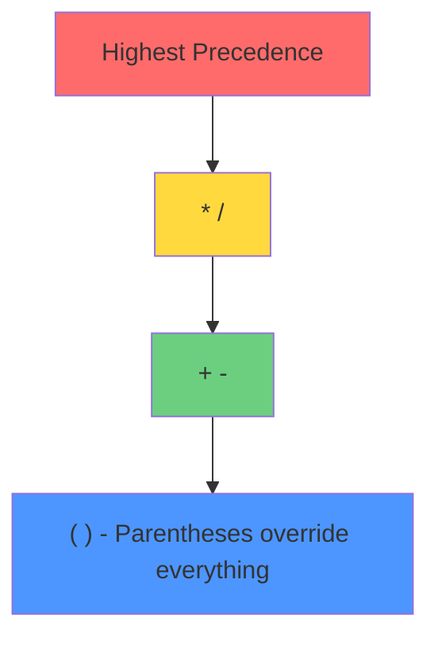

The `%left` declarations tell Yacc:
- `*` and `/` bind tighter than `+` and `-`
- Operations at same level go left-to-right: `8 - 3 - 2` = `(8 - 3) - 2` = `3`

---

## How yyparse Matches Rules: The State Machine

### The Mystery Inside yyparse

When Yacc generates the `yyparse()` function, it doesn't just write if-statements to check grammar rules. Instead, it builds a sophisticated **state machine** with **parse tables** that guide parsing decisions.

Think of it like a GPS navigation system:
- **States** = intersections/locations on a map
- **Tokens** = road signs telling you which way to go
- **Parse tables** = the routing instructions
- **Stack** = your travel history (where you've been)

### What is LALR(1) Parsing?

Yacc generates an **LALR(1) parser**. Let's break this down:

- **L** = Left-to-right scanning (reads input from left to right)
- **A** = Rightmost derivation (builds the parse tree from bottom-up)
- **LR** = Left-to-right, Rightmost derivation
- **1** = Looks ahead one token to make decisions

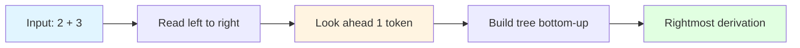

### The Core Algorithm: LR Parsing

The parser operates with three key data structures:

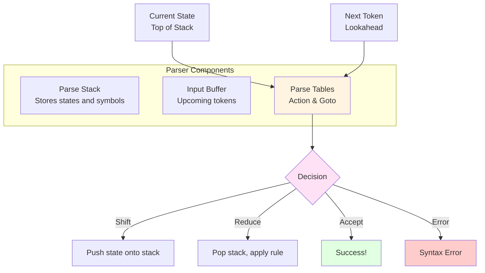

### The Two Parse Tables

Yacc generates two tables that control parsing:

#### 1. Action Table

The **Action Table** tells the parser what to do based on:
- Current state (top of stack)
- Next input token (lookahead)

Possible actions:
- **Shift (sN)**: Push token and go to state N
- **Reduce (rN)**: Apply grammar rule N
- **Accept**: Input is valid, done!
- **Error**: Invalid syntax

#### 2. Goto Table

The **Goto Table** tells the parser which state to enter after a reduction:
- Used after applying a grammar rule
- Based on the non-terminal produced and current state

### Simplified Parse Tables for HOC

Let me show you a simplified version of the tables Yacc generates for our calculator:

**Action Table** (simplified):

| State | NUMBER | + | * | ( | ) | \n | $ |
|-------|--------|---|---|---|---|----|---|
| 0 | s2 | - | - | s3 | - | - | - |
| 1 | - | s4 | s5 | - | - | acc | - |
| 2 | - | r1 | r1 | - | r1 | r1 | - |
| 3 | s2 | - | - | s3 | - | - | - |
| 4 | s2 | - | - | s3 | - | - | - |
| 5 | s2 | - | - | s3 | - | - | - |

**Legend**:
- `s2` = Shift and go to state 2
- `r1` = Reduce using rule 1 (expr: NUMBER)
- `acc` = Accept (parsing complete)
- `-` = Error

**Goto Table** (simplified):

| State | expr | list |
|-------|------|------|
| 0 | 1 | - |
| 3 | 6 | - |
| 4 | 7 | - |

### State Machine Diagram

Here's a simplified state machine for parsing expressions:

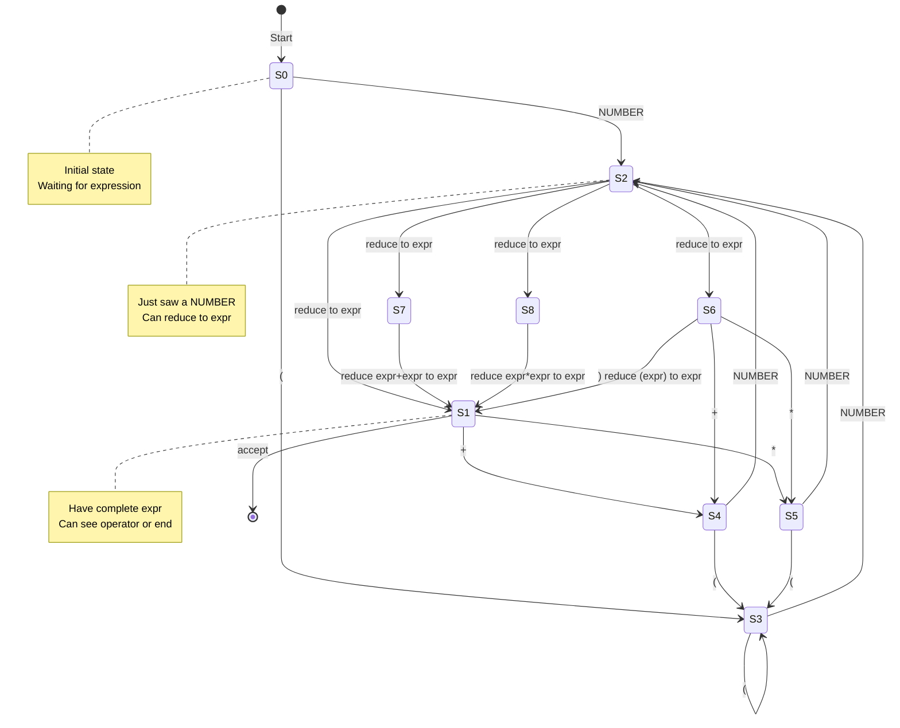

### How State Transitions Work

Each state represents a partial understanding of what the parser has seen:

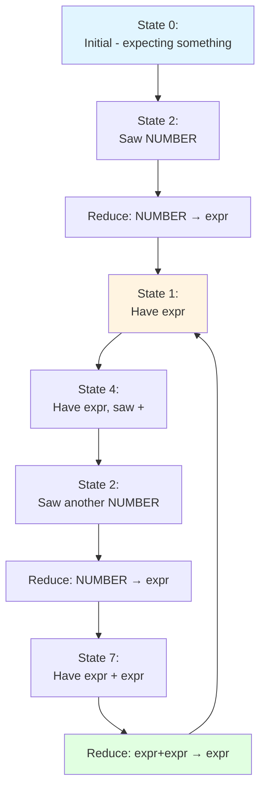

### Complete Example: Parsing "2 + 3"

Let's trace how the state machine parses `2 + 3`:

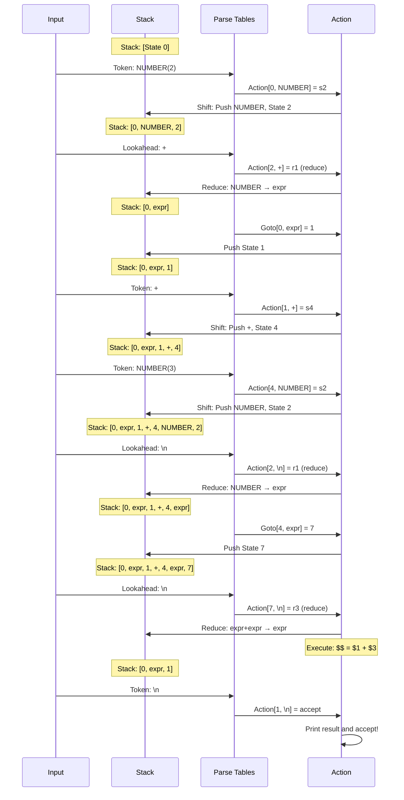

### The Parse Stack in Detail

The parse stack holds **two types** of information alternately:

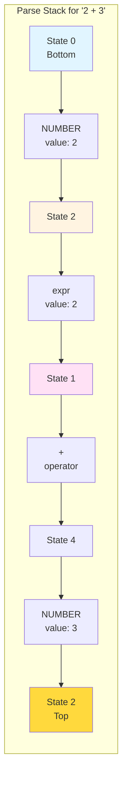

### Shift vs Reduce Decision

The parser constantly asks: **Should I shift (read more) or reduce (apply a rule)?**

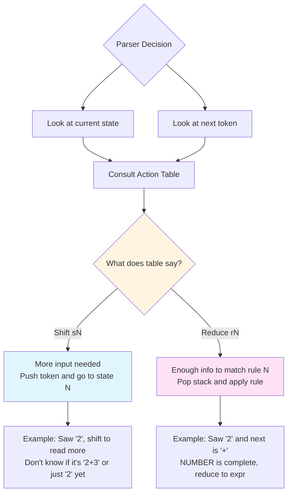

### Why Precedence Matters for State Machine

Precedence declarations affect which states and transitions are generated:

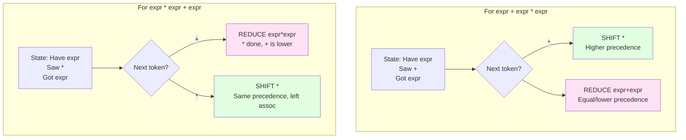

### Real Code: What Yacc Generates

In `hoc.tab.c`, you'll find arrays like:

```c
// State transition tables (simplified)
static const yytype_uint8 yytable[] = {
    2, 7, 0, 3, 14, 15, 16, 17, 4, 5,
    8, 9, 10, 11, 3, 0, 13, 0, 10, 11,
    5, 8, 9, 10, 11, 12
};

// State action decisions
static const yytype_int8 yycheck[] = {
    0, 5, -1, 3, 8, 9, 10, 11, 8, 9,
    4, 5, 6, 7, 3, -1, 10, -1, 6, 7,
    9, 4, 5, 6, 7, 8
};
```

These tables encode the state machine. The parser uses them to make decisions without evaluating complex if-statements for every rule.

### The Parsing Loop

Here's the simplified algorithm inside `yyparse()`:

```c
int yyparse(void)
{
    int state = 0;  // Start in state 0

    while (1) {
        // Get current state from top of stack
        state = stack[stack_top];

        // Get next token if needed
        if (lookahead == EMPTY)
            lookahead = yylex();

        // Consult action table
        action = ACTION_TABLE[state][lookahead];

        if (action == SHIFT) {
            // Shift: push token and new state
            push_stack(lookahead, yylval);
            push_stack(next_state);
            lookahead = EMPTY;  // Token consumed

        } else if (action == REDUCE) {
            // Reduce: apply grammar rule
            rule = WHICH_RULE[action];

            // Pop right-hand side from stack
            for (i = 0; i < rule_length[rule]; i++)
                pop_stack();

            // Execute semantic action ($$ = $1 + $3, etc.)
            execute_action(rule);

            // Push non-terminal and new state
            state = stack[stack_top];
            push_stack(rule_lhs[rule], result_value);
            push_stack(GOTO_TABLE[state][rule_lhs[rule]]);

        } else if (action == ACCEPT) {
            return 0;  // Success!

        } else {
            yyerror("syntax error");
            return 1;  // Failure
        }
    }
}
```

### Visualization: State Machine for "2+3*4"

Let's see the state transitions for a complex expression:

```mermaid
stateDiagram-v2
    [*] --> S0

    note right of S0: Stack: [0]<br/>Input: 2+3*4

    S0 --> S2: NUMBER(2)
    note right of S2: Stack: [0,NUM,2]<br/>Reduce: NUM→expr

    S2 --> S1: goto[0,expr]=1
    note right of S1: Stack: [0,expr,1]<br/>Input: +3*4

    S1 --> S4: +(shift)
    note right of S4: Stack: [0,expr,1,+,4]<br/>Input: 3*4

    S4 --> S2_2: NUMBER(3)
    note right of S2_2: Stack: [0,expr,1,+,4,NUM,2]<br/>Reduce: NUM→expr

    S2_2 --> S7: goto[4,expr]=7
    note right of S7: Stack: [0,expr,1,+,4,expr,7]<br/>Input: *4<br/>SHIFT (higher prec)

    S7 --> S5: *(shift)
    note right of S5: Stack: [...,expr,7,*,5]<br/>Input: 4

    S5 --> S2_3: NUMBER(4)
    note right of S2_3: Reduce: NUM→expr

    S2_3 --> S8: goto[5,expr]=8
    note right of S8: Reduce: expr*expr→expr<br/>Action: 3*4=12

    S8 --> S7_2: goto[4,expr]=7
    note right of S7_2: Stack: [0,expr,1,+,4,expr,7]<br/>Now reduce: expr+expr

    S7_2 --> S1_2: goto[0,expr]=1
    note right of S1_2: Stack: [0,expr,1]<br/>Result: 14

    S1_2 --> [*]: Accept
```

### Key Insights: Why State Machines?

**Efficiency**:
- Table lookup is O(1) - extremely fast
- No need to check every grammar rule every time
- Thousands of rules? Still instant decisions

**Correctness**:
- Yacc mathematically proves the grammar is parseable
- Detects conflicts (ambiguities) at compile-time
- Generated parser is guaranteed correct

**Precedence Handling**:
- Encoded directly in the state transitions
- No runtime if-statements needed
- Shift/reduce conflicts resolved by precedence

### What Happens with Conflicts?

Sometimes grammar is ambiguous. Yacc reports:

```
hoc.y:23: shift/reduce conflict
```

This means: "In some state, I don't know whether to shift or reduce"

Example ambiguity:
```yacc
expr : expr '+' expr    // Could reduce this
     | expr '*' expr    // Or shift to see if * comes next
```

The `%left` declarations tell Yacc how to resolve these conflicts!

### State Machine Summary

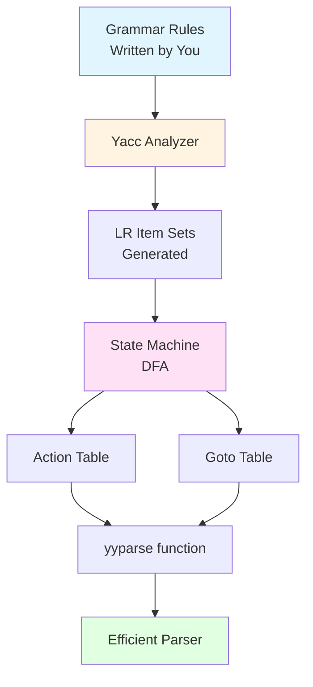

**The Bottom Line**:
- Yacc converts your grammar into a **Deterministic Finite Automaton (DFA)**
- The DFA has **states** representing partial parses
- **Parse tables** encode state transitions
- `yyparse()` is a simple loop: consult tables, shift or reduce
- This architecture makes parsing fast, correct, and handles precedence automatically!

---

## Expression Evaluation

### How the Parser Evaluates Expressions

The parser builds a **parse tree** and evaluates it bottom-up.

### Example: Evaluating `2 + 3 * 4`

**Step 1: Lexer produces tokens**
```
NUMBER(2) → '+' → NUMBER(3) → '*' → NUMBER(4) → '\n'
```

**Step 2: Parser builds and evaluates tree**

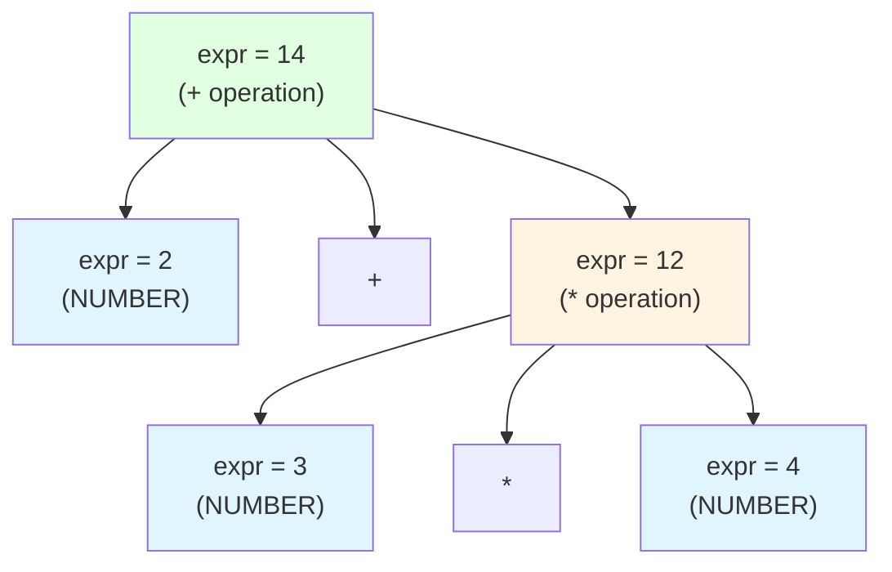

**Evaluation Order** (bottom-up):

1. **Match**: `NUMBER` → `expr` with value 2
   ```
   Rule: expr : NUMBER { $$ = $1; }
   Result: expr = 2
   ```

2. **Match**: `NUMBER` → `expr` with value 3
   ```
   Rule: expr : NUMBER { $$ = $1; }
   Result: expr = 3
   ```

3. **Match**: `NUMBER` → `expr` with value 4
   ```
   Rule: expr : NUMBER { $$ = $1; }
   Result: expr = 4
   ```

4. **Match**: `expr '*' expr` (3 * 4)
   ```
   Rule: expr : expr '*' expr { $$ = $1 * $3; }
   $1 = 3, $3 = 4
   Result: $$ = 3 * 4 = 12
   ```

5. **Match**: `expr '+' expr` (2 + 12)
   ```
   Rule: expr : expr '+' expr { $$ = $1 + $3; }
   $1 = 2, $3 = 12
   Result: $$ = 2 + 12 = 14
   ```

6. **Match**: `list expr '\n'` (print result)
   ```
   Rule: list : list expr '\n' { printf("\t%.8g\n", $2); }
   $2 = 14
   Action: Print "14"
   ```

### Why Does `*` Happen Before `+`?

Because of the precedence declarations:
```yacc
%left '+' '-'    /* Declared first = lower precedence */
%left '*' '/'    /* Declared second = higher precedence */
```

Yacc ensures higher precedence operators are reduced (evaluated) first.

---

## Complete Example Walkthrough

Let's trace the complete execution of: `(2 + 3) * 4`

### Step-by-Step Execution

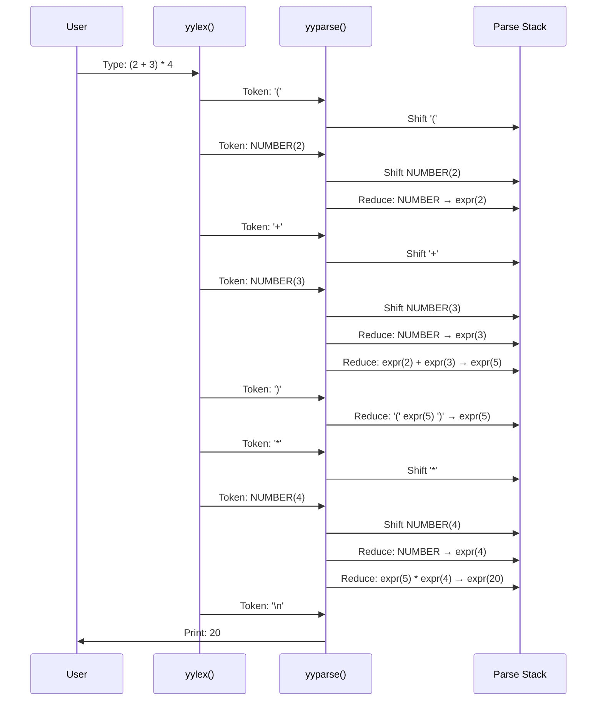

### Parse Stack Visualization

The parser uses a **stack** to keep track of what it has seen:

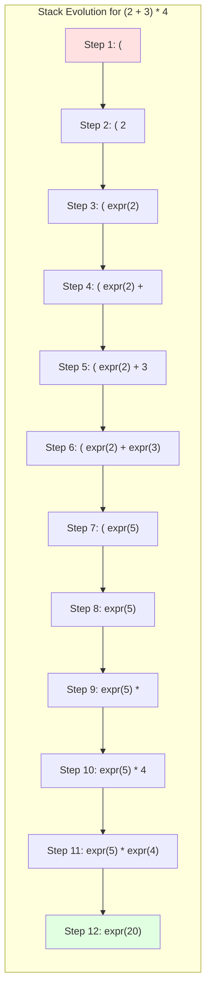

### Parsing Actions Explained

1. **Shift**: Push token onto stack (save for later)
2. **Reduce**: Replace top of stack with a grammar rule's left side
   - Example: Replace `NUMBER` with `expr`
   - Example: Replace `expr + expr` with `expr`

---

## How Values Flow Through the System

### The Value Semantic Stack

Yacc maintains a **semantic value stack** parallel to the token stack. This holds the actual values.

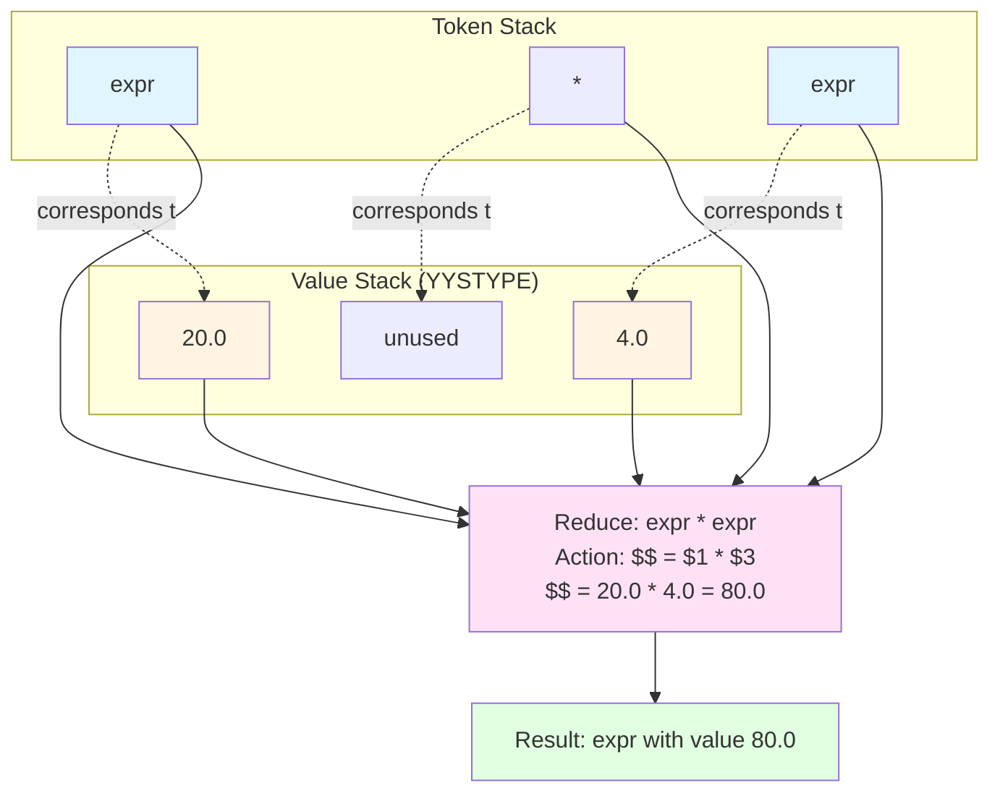

### YYSTYPE: The Value Type

```c
#define YYSTYPE double
```

This tells Yacc that all semantic values are `double` (floating-point numbers).

- When lexer sets `yylval = 3.14`, it's setting a double
- When parser uses `$1`, it's accessing a double
- When action does `$$ = $1 + $3`, it's computing with doubles

### Complete Data Flow

```mermaid
flowchart TB
    A["Input String:<br/>'2 + 3'"] --> B[yylex reads '2']
    B --> C["yylex sets:<br/>yylval = 2.0"]
    C --> D["yylex returns:<br/>NUMBER token"]
    D --> E["Parser shifts:<br/>NUMBER onto stack"]
    E --> F["Parser pushes:<br/>2.0 onto value stack"]

    F --> G["Parser reduces:<br/>NUMBER → expr"]
    G --> H["Value 2.0 stays<br/>in value stack"]

    H --> I["... same for '+'<br/>and NUMBER(3) ..."]

    I --> J["Parser reduces:<br/>expr '+' expr"]
    J --> K["Action: $$ = $1 + $3<br/>$$ = 2.0 + 3.0"]
    K --> L["Push result 5.0<br/>onto value stack"]

    L --> M["Match: list expr '\\n'<br/>$2 = 5.0"]
    M --> N["Action: printf $2"]
    N --> O["Output: 5"]

    style A fill:#e1f5ff
    style C fill:#fff4e1
    style K fill:#ffe1f5
    style O fill:#e1ffe1
```

---

## Advanced Concepts

### Error Handling

When the parser encounters invalid input:

```c
void yyerror(const char *s)
{
    fprintf(stderr, "%s: %s near line %d\n", progname, s, lineno);
}
```

Example error:
```
Input:  2 + + 3
Output: hoc: syntax error near line 1
```

The parser calls `yyerror()` when it receives tokens that don't match any grammar rule.

### Line Number Tracking

```c
int lineno = 1;  // Global variable

// In yylex():
if (c == '\n') lineno++;
```

This allows error messages to show which line has the problem.

### Main Program Flow

```mermaid
graph TB
    A[main starts] --> B[progname = argv0]
    B --> C[yyparse called]
    C --> D{yyparse calls yylex}
    D -->|Has input| E[yylex returns token]
    E --> F[yyparse processes token]
    F --> D
    D -->|EOF reached| G[yyparse returns]
    G --> H[Program exits]

    F -.Error?.- I[Call yyerror]
    I --> D

    F -.Match print rule?.- J[printf result]
    J --> D

    style A fill:#e1f5ff
    style C fill:#fff4e1
    style E fill:#ffe1f5
    style H fill:#e1ffe1
```

### The Complete Picture

```mermaid
flowchart TB
    subgraph "HOC Calculator System"
        direction TB

        subgraph "Input Layer"
            A[User Types Expression]
        end

        subgraph "Lexical Analysis"
            B[yylex reads characters]
            C[Identifies token type]
            D[Sets yylval for NUMBER]
            E[Returns token to parser]
        end

        subgraph "Syntax Analysis"
            F[yyparse receives token]
            G[Shift or Reduce decision]
            H[Execute grammar rule action]
        end

        subgraph "Evaluation"
            I[Perform arithmetic]
            J[Push result to value stack]
        end

        subgraph "Output Layer"
            K[Print result]
        end

        A --> B
        B --> C
        C --> D
        D --> E
        E --> F
        F --> G
        G --> H
        H --> I
        I --> J
        J --> G
        G -.Final result.-> K
        K -.Ready for next.-> A
    end

    style A fill:#e1f5ff
    style B fill:#fff4e1
    style F fill:#ffe1f5
    style I fill:#ffd93d
    style K fill:#e1ffe1
```

---

## Key Takeaways

### For Beginners

1. **Lexer** (yylex): Breaks input into tokens
   - Like cutting a sentence into words

2. **Parser** (yyparse): Checks grammar and evaluates
   - Like understanding sentence structure and meaning

3. **Grammar Rules**: Define what's valid
   - Like the rules of English grammar

4. **Semantic Actions**: What to do when rules match
   - The actual calculations: `$$ = $1 + $3`

5. **Value Flow**: yylval → $1/$2/$3 → $$
   - How numbers travel through the system

### How It All Works Together

```
User types: 2 + 3 * 4

1. Lexer breaks it into: [NUMBER(2), '+', NUMBER(3), '*', NUMBER(4), '\n']

2. Parser builds tree respecting precedence:
         +
        / \
       2   *
          / \
         3   4

3. Evaluation (bottom-up):
   - 3 * 4 = 12
   - 2 + 12 = 14

4. Output: 14
```

### Why This Architecture?

- **Separation of Concerns**: Lexer doesn't know grammar, parser doesn't know characters
- **Maintainability**: Change grammar without rewriting lexer
- **Reusability**: Yacc can generate parsers for any grammar
- **Correctness**: Yacc handles complex cases automatically

---

## Practice Exercises

### Exercise 1: Trace This Expression
Trace `5 - 2 - 1` step by step. What's the result? Why?

<details>
<summary>Answer</summary>

Result: 2

Explanation: Left-associative means `(5 - 2) - 1 = 3 - 1 = 2`, not `5 - (2 - 1) = 5 - 1 = 4`
</details>

### Exercise 2: Precedence Challenge
What's the result of `2 + 3 * 4 - 6 / 2`?

<details>
<summary>Answer</summary>

Result: 11

Evaluation:
1. `3 * 4 = 12` (multiplication first)
2. `6 / 2 = 3` (division first)
3. `2 + 12 = 14` (left to right)
4. `14 - 3 = 11` (left to right)
</details>

### Exercise 3: What Happens Here?
Input: `2 + (3 * 4`

What happens? Why?

<details>
<summary>Answer</summary>

Error: "syntax error"

Missing closing parenthesis. Parser expects ')' but gets '\n' or EOF.
</details>

---

## Conclusion

The HOC calculator demonstrates fundamental concepts in language processing:

- **Tokenization**: Breaking input into meaningful pieces
- **Parsing**: Checking structure and building representations
- **Evaluation**: Computing results from structured representations
- **Tool-Assisted Development**: Using Yacc to generate complex code

These same principles apply to:
- Programming language compilers (C, Java, Python)
- Query languages (SQL)
- Markup languages (HTML, XML)
- Configuration files (JSON, YAML)

Understanding HOC gives you the foundation to build more complex language processors!

---

## Further Reading

- **Dragon Book**: "Compilers: Principles, Techniques, and Tools" by Aho, Lam, Sethi, Ullman
- **Yacc Documentation**: GNU Bison manual
- **Flex & Bison**: "flex & bison" by John Levine
- **Practice**: Try extending HOC with functions like `sin()`, `cos()`, or variables!
