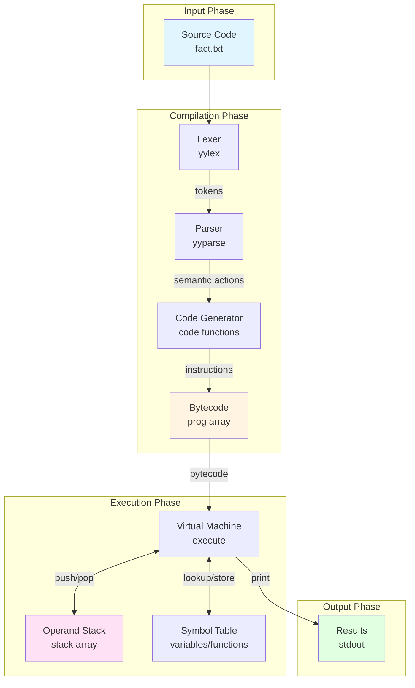
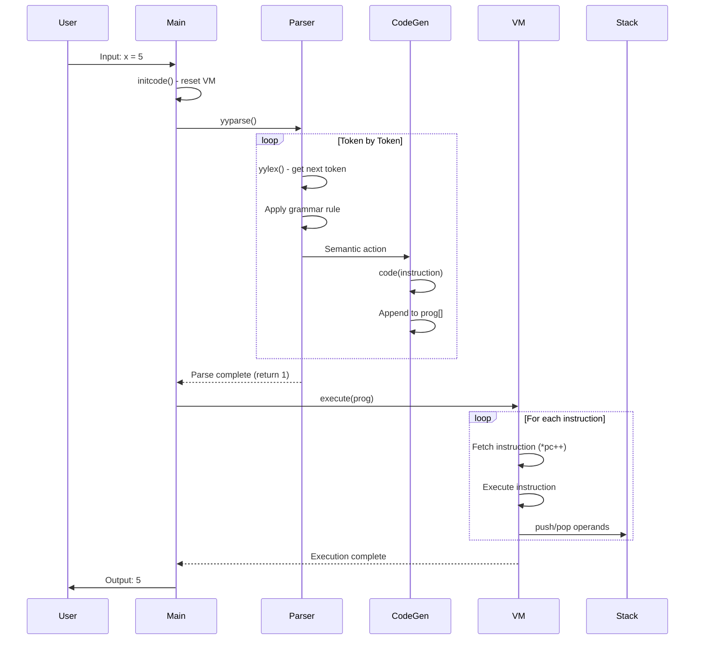
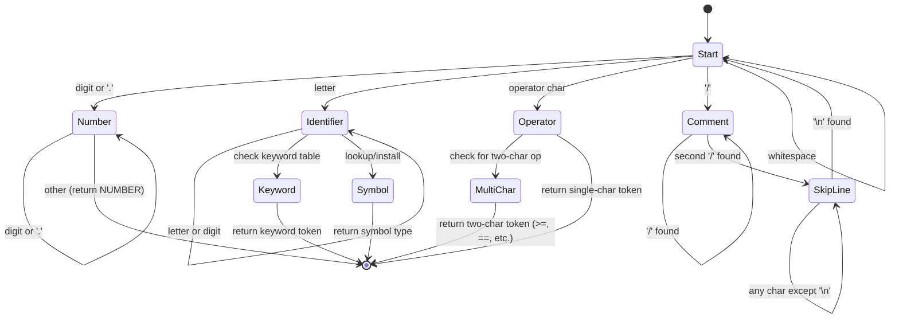
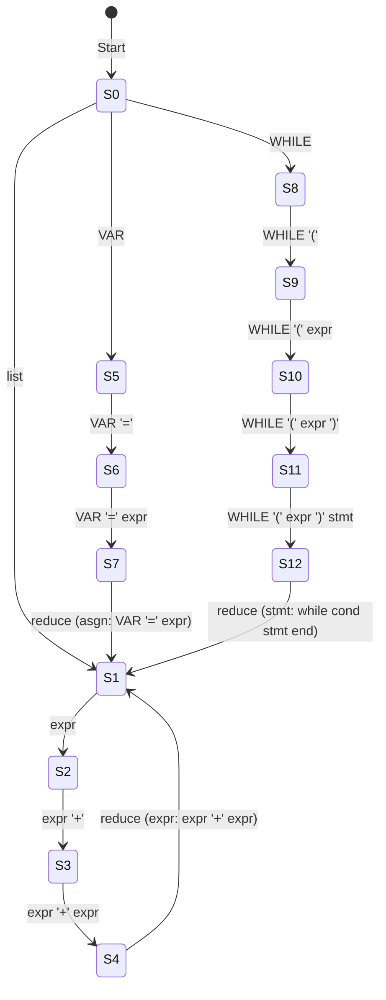
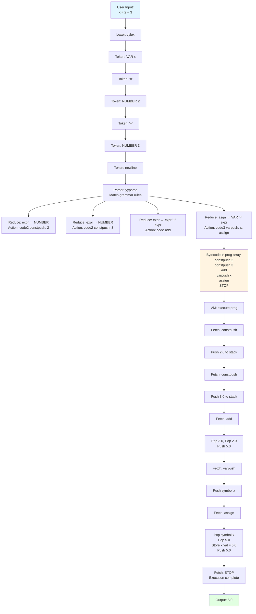
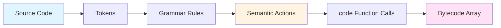

# Stage 5: HOC - Complete Turing-Complete Language with Control Flow

## Table of Contents
1. [Overview](#overview)
2. [Project Structure](#project-structure)
3. [System Architecture](#system-architecture)
4. [Components and Responsibilities](#components-and-responsibilities)
5. [Lexer and Parser Processing](#lexer-and-parser-processing)
6. [End-to-End Flow](#end-to-end-flow)
7. [Code to Opcode Translation](#code-to-opcode-translation)
8. [Language Grammar Reference](#language-grammar-reference)
9. [Sample Programs](#sample-programs)
10. [Extension Ideas & Exercises](#extension-ideas--exercises)

---

## Overview

Stage 5 represents the final evolution of the HOC calculator into a **Turing-complete programming language**. It features:

- ✅ **Control Flow**: `while` loops, `if-else` conditionals
- ✅ **Relational Operators**: `>`, `>=`, `<`, `<=`, `==`, `!=`
- ✅ **Logical Operators**: `&&`, `||`, `!`
- ✅ **Statement Blocks**: `{ stmt; stmt; }`
- ✅ **Built-in Functions**: sin, cos, atan, ln, log, exp, sqrt, int, abs, atan2, rand
- ✅ **Mathematical Constants**: PI, E, GAMMA, DEG, PHI
- ✅ **Variables**: Unlimited named variables
- ✅ **Comments**: `//` single-line comments
- ✅ **System Commands**: Execute shell commands with `sys-`

**Execution Model**: Two-phase compilation - source code is compiled to bytecode instructions, then executed on a stack-based virtual machine.

---

## Project Structure

```
Stage5/
├── hoc.y              # Yacc/Bison grammar specification
│                      # - Lexer (yylex function)
│                      # - Parser rules and semantic actions
│                      # - Code generation directives
│
├── hoc.h              # Core type definitions
│                      # - symbol struct (symbol table entries)
│                      # - Datum union (stack element type)
│                      # - Inst function pointer type
│
├── symbol.c           # Symbol table implementation
│                      # - install(): add symbols to table
│                      # - lookup(): find symbols by name
│                      # - emalloc(): safe memory allocation
│
├── init.c             # Initialization and built-in registration
│                      # - Constants: PI, E, GAMMA, DEG, PHI
│                      # - Built-in functions: sin, cos, sqrt, etc.
│                      # - Keywords: if, else, while, print
│                      # - dispatch(): dynamic function invocation
│
├── math.c             # Custom mathematical functions
│                      # - Rand(): random number generator
│                      # - Atan(), Atan2(): angle functions in degrees
│
├── code.c             # Virtual machine implementation
│                      # - Stack operations: push(), pop()
│                      # - Code generation: code()
│                      # - Execution engine: execute()
│                      # - VM instructions: add, sub, mul, etc.
│                      # - Control flow: whilecode, ifcode
│
├── makefile           # Build configuration
├── fact.txt           # Example: factorial calculator
├── fib.txt            # Example: Fibonacci sequence
└── README.md          # This file
```

### Generated Files (created during build)
- `hoc.tab.c` - Generated parser code from Bison
- `hoc.tab.h` - Token definitions and constants
- `*.o` - Compiled object files
- `hoc5` - Final executable

---

## System Architecture

### High-Level Architecture



### Two-Phase Execution Model



---

## Components and Responsibilities

### 1. Lexer (yylex) - Tokenization
**File**: `hoc.y` (lines 121-191)

**Responsibilities**:
- Scan input character by character
- Recognize token patterns (numbers, identifiers, operators)
- Skip whitespace and comments (`//`)
- Return token type to parser
- Store token value in `yylval`

**Token Types**:
```c
NUMBER  // 3.14, 42, .5
VAR     // x, myvar, result
BLTIN   // sin, cos, sqrt (1 argument)
BLTIN2  // atan2 (2 arguments)
BLTIN0  // rand (0 arguments)
CNST    // PI, E, GAMMA
WHILE   // while keyword
IF      // if keyword
ELSE    // else keyword
PRINT   // print keyword
SYS     // sys- (system command)
GT      // >
GE      // >=
LT      // <
LE      // <=
EQ      // ==
NE      // !=
AND     // &&
OR      // ||
NOT     // !
```

### 2. Parser (yyparse) - Syntax Analysis
**File**: `hoc.y` (lines 52-111)

**Responsibilities**:
- Match token sequences against grammar rules
- Build parse tree implicitly through reductions
- Execute semantic actions (code generation)
- Handle operator precedence and associativity
- Recover from syntax errors

**Grammar Rules**:
```yacc
list:    /* top-level statements */
asgn:    /* variable assignment */
stmt:    /* statement (expr, print, while, if, block) */
cond:    /* condition in parentheses */
expr:    /* expression with operators */
```

### 3. Symbol Table (symbol.c) - Name Resolution
**File**: `symbol.c`

**Responsibilities**:
- Store symbols (variables, functions, constants, keywords)
- Fast lookup by name
- Type management (VAR, BLTIN, CNST, UNDEF, etc.)
- Memory management for symbol names

**Data Structure**:
```c
typedef struct symbol {
    char *name;           // "x", "sin", "PI"
    short type;           // VAR, BLTIN, CNST, etc.
    union {
        double val;       // For variables/constants
        double (*ptr)();  // For built-in functions
    } u;
    struct symbol *next;  // Linked list
} symbol;
```

**Implementation**: Simple linked list (inserts at head for O(1) insertion)

### 4. Code Generator (code) - Bytecode Emission
**File**: `code.c` (lines 61-73)

**Responsibilities**:
- Append instructions to program buffer (`prog[]`)
- Dynamically resize buffer as needed
- Return pointer to emitted instruction (for backpatching)

**API**:
```c
Inst *code(Inst f);           // Emit single instruction
#define code2(c1,c2)          // Emit two instructions
#define code3(c1,c2,c3)       // Emit three instructions
```

### 5. Virtual Machine (execute) - Execution Engine
**File**: `code.c` (lines 75-79)

**Responsibilities**:
- Fetch-decode-execute loop
- Maintain program counter (pc)
- Execute instruction functions
- Stop at STOP marker

**Execution Loop**:
```c
for (pc = p; *pc != STOP; )
    (*(*pc++))();  // Call instruction function and increment pc
```

### 6. Operand Stack (stack) - Computation
**File**: `code.c` (lines 41-57)

**Responsibilities**:
- Store intermediate computation results
- Push operands before operations
- Pop operands for operations
- Push results after operations
- Dynamic growth via `realloc()`

**Stack Element**:
```c
typedef union Datum {
    double val;    // Numeric value
    symbol *sym;   // Symbol pointer
} Datum;
```

### 7. Instruction Set - VM Operations
**File**: `code.c` (lines 81-342)

**Categories**:

**Arithmetic**: `add`, `sub`, `mul`, `div_`, `mod`, `power`, `negate`
**Stack Management**: `constpush`, `varpush`, `pop`
**Variables**: `eval`, `assign`
**Comparison**: `gt`, `ge`, `lt`, `le`, `eq`, `ne`
**Logical**: `and_`, `or_`, `not_`
**Control Flow**: `whilecode`, `ifcode`
**I/O**: `print`, `prexpr`
**Functions**: `bltin`
**Special**: `prevset` (store in _), `sys` (shell command)

---

## Lexer and Parser Processing

### Lexer State Machine

The lexer implements a finite state machine to recognize different token types:



### Lexer Implementation Details

**Number Recognition** (lines 125-132):
```c
if (isdigit(c) || c == '.') {
    double d;
    ungetc(c, stdin);      // Put character back
    scanf("%lf", &d);      // Use scanf to parse number
    yylval.sym = install("", NUMBER, d);  // Store in symbol table
    return NUMBER;         // Return token type
}
```

**Identifier Recognition** (lines 134-166):
```c
if (isalpha(c)) {
    char sbuf[100];
    char *p = sbuf;
    do {
        *p++ = c;
    } while ((c = getchar()) != EOF && isalnum(c));
    ungetc(c, stdin);
    *p = '\0';

    // Lookup in symbol table
    if ((s = lookup(sbuf)) == 0)
        s = install(sbuf, UNDEF, 0.0);  // New identifier

    yylval.sym = s;
    return s->type == UNDEF ? VAR : s->type;
}
```

**Two-Character Operators** (lines 182-187):
```c
switch(c) {
    case '>': return follow('=', GE, GT);  // >= or >
    case '<': return follow('=', LE, LT);  // <= or <
    case '=': return follow('=', EQ, '='); // == or =
    case '!': return follow('=', NE, NOT); // != or !
    case '|': return follow('|', OR, '|'); // || or |
    case '&': return follow('&', AND, '&'); // && or &
}
```

### Parser State Machine (LALR)

Bison generates an LALR(1) parser with states and actions. Here's a simplified view:



### Shift and Reduce Actions

**Example 1: Simple Expression `2 + 3`**

| Stack | Input | Action |
|-------|-------|--------|
| $ | 2 + 3 $ | Shift 2 |
| $ 2 | + 3 $ | Reduce: expr → NUMBER |
| $ expr | + 3 $ | Shift + |
| $ expr + | 3 $ | Shift 3 |
| $ expr + 3 | $ | Reduce: expr → NUMBER |
| $ expr + expr | $ | Reduce: expr → expr '+' expr |
| $ expr | $ | Accept |

**Semantic Actions During Parse**:
```c
expr: NUMBER              { $$ = code2(constpush, (Inst)$1); }
    | expr '+' expr       { code(add); }
```

**Generated Bytecode**:
```
constpush <symbol_ptr_to_2>
constpush <symbol_ptr_to_3>
add
```

**Example 2: Expression with Precedence `2 + 3 * 4`**

| Stack | Input | Action | Bytecode Generated |
|-------|-------|--------|--------------------|
| $ | 2 + 3 * 4 $ | Shift 2 | - |
| $ 2 | + 3 * 4 $ | Reduce: expr → NUMBER | constpush(2) |
| $ expr | + 3 * 4 $ | Shift + | - |
| $ expr + | 3 * 4 $ | Shift 3 | - |
| $ expr + 3 | * 4 $ | Reduce: expr → NUMBER | constpush(3) |
| $ expr + expr | * 4 $ | **Shift * (precedence!)** | - |
| $ expr + expr * | 4 $ | Shift 4 | - |
| $ expr + expr * 4 | $ | Reduce: expr → NUMBER | constpush(4) |
| $ expr + expr * expr | $ | Reduce: expr → expr '*' expr | mul |
| $ expr + expr | $ | Reduce: expr → expr '+' expr | add |
| $ expr | $ | Accept | - |

**Key Point**: Due to operator precedence (`*` higher than `+`), the parser **shifts** `*` instead of reducing `expr + expr`, ensuring correct evaluation order.

**Final Bytecode** (evaluates to 14, not 20):
```
constpush(2)
constpush(3)
constpush(4)
mul          # 3 * 4 = 12
add          # 2 + 12 = 14
```

**Example 3: Variable Assignment `x = 5 + 3`**

| Stack | Input | Action | Bytecode Generated |
|-------|-------|--------|--------------------|
| $ | x = 5 + 3 $ | Shift x | - |
| $ x | = 5 + 3 $ | Shift = | - |
| $ x = | 5 + 3 $ | Shift 5 | - |
| $ x = 5 | + 3 $ | Reduce: expr → NUMBER | constpush(5) |
| $ x = expr | + 3 $ | Shift + | - |
| $ x = expr + | 3 $ | Shift 3 | - |
| $ x = expr + 3 | $ | Reduce: expr → NUMBER | constpush(3) |
| $ x = expr + expr | $ | Reduce: expr → expr '+' expr | add |
| $ x = expr | $ | Reduce: asgn → VAR '=' expr | varpush(x), assign |

**Semantic Action**:
```c
asgn: VAR '=' expr { $$ = $3; code3(varpush, (Inst)$1, assign); }
```

**Final Bytecode**:
```
constpush(5)
constpush(3)
add
varpush(x)
assign
```

**Example 4: While Loop with Backpatching**

Source: `while (x > 0) x = x - 1`

**Parse Steps**:
1. Recognize `while` keyword → Execute action: `code3(whilecode, STOP, STOP)`
2. This emits placeholder instructions at positions [p, p+1, p+2]
3. Parse condition `x > 0` → generates condition evaluation bytecode
4. Parse body `x = x - 1` → generates body bytecode
5. **Backpatch**: Fill in placeholders with actual addresses

**Backpatching in Grammar**:
```c
while: WHILE  { $$ = code3(whilecode, STOP, STOP); }

stmt: while cond stmt end { ($1)[1] = (Inst)$3;   // Body address
                             ($1)[2] = (Inst)$4; } // End address
```

**Generated Structure**:
```
[0]  whilecode
[1]  <body_addr>    ← backpatched
[2]  <end_addr>     ← backpatched
[3]  varpush(x)     ← condition starts here
[4]  eval
[5]  constpush(0)
[6]  gt
[7]  STOP           ← condition ends
[8]  varpush(x)     ← body starts here
[9]  eval
[10] constpush(1)
[11] sub
[12] varpush(x)
[13] assign
[14] pop
[15] STOP           ← body ends
[16] ...            ← next statement
```

---

## End-to-End Flow

### Complete Execution Example: `x = 2 + 3`



### Detailed VM Execution Trace

**Program**: `x = 2 + 3`

**Bytecode**:
```
[0] constpush <ptr_to_2>
[1] constpush <ptr_to_3>
[2] add
[3] varpush <ptr_to_x>
[4] assign
[5] prevset
[6] pop
[7] STOP
```

**Stack Evolution**:

| Step | PC | Instruction | Action | Stack State | Notes |
|------|----|-----------|---------|-----------------------------|-------|
| 0 | 0 | - | Init | [] | Empty stack |
| 1 | 0 | constpush | Fetch | [] | Read instruction |
| 2 | 1 | - | Execute | [val: 2.0] | Push constant 2.0 |
| 3 | 1 | constpush | Fetch | [val: 2.0] | Read instruction |
| 4 | 2 | - | Execute | [val: 2.0, val: 3.0] | Push constant 3.0 |
| 5 | 2 | add | Fetch | [val: 2.0, val: 3.0] | Read instruction |
| 6 | 3 | - | Execute | [val: 5.0] | Pop 2 & 3, add, push 5 |
| 7 | 3 | varpush | Fetch | [val: 5.0] | Read instruction |
| 8 | 4 | - | Execute | [val: 5.0, sym: x] | Push symbol x |
| 9 | 4 | assign | Fetch | [val: 5.0, sym: x] | Read instruction |
| 10 | 5 | - | Execute | [val: 5.0] | Pop x & 5, x.val=5, push 5 |
| 11 | 5 | prevset | Fetch | [val: 5.0] | Read instruction |
| 12 | 6 | - | Execute | [val: 5.0] | Store in _, push 5 |
| 13 | 6 | pop | Fetch | [val: 5.0] | Read instruction |
| 14 | 7 | - | Execute | [] | Pop and discard |
| 15 | 7 | STOP | Done | [] | Exit execution loop |

### Control Flow Example: `if (x > 5) print(x)`

**Bytecode Structure**:
```
[0]  ifcode
[1]  <then_addr>    ← backpatched to [5]
[2]  NULL           ← no else clause
[3]  <end_addr>     ← backpatched to [9]
[4]  varpush(x)     ← condition starts
[5]  eval
[6]  constpush(5)
[7]  gt
[8]  STOP           ← condition ends
[9]  varpush(x)     ← then clause starts
[10] eval
[11] prexpr
[12] STOP           ← then clause ends
[13] ...            ← next statement
```

**VM Execution** (`x = 10`):
1. Execute `ifcode` at [0]
2. Save pc (points to [1])
3. Execute condition: [4-8] → evaluates to 1.0 (true)
4. Pop condition result: 1.0
5. Since true, execute then clause: jump to [9]
6. Execute [9-12]: prints 10.000000
7. Jump to end: [13]

**VM Execution** (`x = 3`):
1. Execute `ifcode` at [0]
2. Save pc (points to [1])
3. Execute condition: [4-8] → evaluates to 0.0 (false)
4. Pop condition result: 0.0
5. Since false and no else, skip to end: [13]

---

## Code to Opcode Translation

### Translation Process



### Example 1: Arithmetic Expression

**Source**: `2 + 3 * 4`

**Parse Tree**:
```
         +
       /   \
      2     *
          /   \
         3     4
```

**Code Generation (Post-Order Traversal)**:
```c
// Parse: NUMBER (2)
code2(constpush, (Inst)symbol_2);

// Parse: NUMBER (3)
code2(constpush, (Inst)symbol_3);

// Parse: NUMBER (4)
code2(constpush, (Inst)symbol_4);

// Reduce: expr * expr
code(mul);

// Reduce: expr + expr
code(add);
```

**Generated Bytecode**:
```
constpush <sym_2>    // Push 2
constpush <sym_3>    // Push 3
constpush <sym_4>    // Push 4
mul                  // 3 * 4 = 12
add                  // 2 + 12 = 14
```

### Example 2: Variable Assignment with Function Call

**Source**: `result = sqrt(16) + 5`

**Code Generation**:
```c
// Parse: NUMBER (16)
code2(constpush, (Inst)symbol_16);

// Parse: BLTIN '(' expr ')'
code2(bltin, (Inst)sqrt_symbol);

// Parse: NUMBER (5)
code2(constpush, (Inst)symbol_5);

// Reduce: expr + expr
code(add);

// Reduce: VAR '=' expr
code3(varpush, (Inst)result_symbol, assign);
```

**Generated Bytecode**:
```
constpush <16>       // Push 16
bltin <sqrt>         // Call sqrt: pop 16, push 4.0
constpush <5>        // Push 5
add                  // 4 + 5 = 9
varpush <result>     // Push symbol 'result'
assign               // Pop result & 9, store, push 9
```

**Stack Trace**:
```
Step 1: [16.0]
Step 2: [4.0]           // sqrt(16)
Step 3: [4.0, 5.0]
Step 4: [9.0]           // add
Step 5: [9.0, result]
Step 6: [9.0]           // assign (result.val = 9.0)
```

### Example 3: While Loop

**Source**:
```c
sum = 0
i = 1
while (i <= 10) {
    sum = sum + i
    i = i + 1
}
```

**Code Generation for While Loop**:
```c
// Parse: WHILE
Inst *savewhile = code3(whilecode, STOP, STOP);

// Parse: condition (i <= 10)
Inst *savecond = progp;  // Mark condition start
code3(varpush, (Inst)i_sym, eval);
code2(constpush, (Inst)symbol_10);
code(le);
code(STOP);

// Parse: body
Inst *savebody = progp;  // Mark body start
// sum = sum + i
code3(varpush, (Inst)sum_sym, eval);
code3(varpush, (Inst)i_sym, eval);
code(add);
code3(varpush, (Inst)sum_sym, assign);
code(pop);
// i = i + 1
code3(varpush, (Inst)i_sym, eval);
code2(constpush, (Inst)symbol_1);
code(add);
code3(varpush, (Inst)i_sym, assign);
code(pop);
code(STOP);

// Backpatch
Inst *saveend = progp;
savewhile[1] = (Inst)savebody;  // Body address
savewhile[2] = (Inst)saveend;   // End address
```

**Generated Bytecode**:
```
[0]  whilecode
[1]  <body_addr> = [8]
[2]  <end_addr> = [22]
[3]  varpush(i)          ← condition
[4]  eval
[5]  constpush(10)
[6]  le
[7]  STOP
[8]  varpush(sum)        ← body
[9]  eval
[10] varpush(i)
[11] eval
[12] add
[13] varpush(sum)
[14] assign
[15] pop
[16] varpush(i)
[17] eval
[18] constpush(1)
[19] add
[20] varpush(i)
[21] assign
[22] pop
[23] STOP
[24] ...                 ← next statement
```

### Example 4: If-Else Statement

**Source**:
```c
if (x > 0)
    y = 1
else
    y = -1
```

**Code Generation**:
```c
// Parse: IF
Inst *saveif = code(ifcode);
code3(STOP, STOP, STOP);  // Placeholders

// Parse: condition (x > 0)
Inst *savecond = progp;
code3(varpush, (Inst)x_sym, eval);
code2(constpush, (Inst)symbol_0);
code(gt);
code(STOP);

// Parse: then clause (y = 1)
Inst *savethen = progp;
code2(constpush, (Inst)symbol_1);
code3(varpush, (Inst)y_sym, assign);
code(pop);
code(STOP);

// Parse: else clause (y = -1)
Inst *saveelse = progp;
code2(constpush, (Inst)symbol_minus1);
code3(varpush, (Inst)y_sym, assign);
code(pop);
code(STOP);

// Backpatch
Inst *saveend = progp;
saveif[1] = (Inst)savethen;   // Then address
saveif[2] = (Inst)saveelse;   // Else address
saveif[3] = (Inst)saveend;    // End address
```

**Generated Bytecode**:
```
[0]  ifcode
[1]  <then_addr> = [8]
[2]  <else_addr> = [13]
[3]  <end_addr> = [18]
[4]  varpush(x)          ← condition
[5]  eval
[6]  constpush(0)
[7]  gt
[8]  STOP
[9]  constpush(1)        ← then clause
[10] varpush(y)
[11] assign
[12] pop
[13] STOP
[14] constpush(-1)       ← else clause
[15] varpush(y)
[16] assign
[17] pop
[18] STOP
[19] ...                 ← next statement
```

---

## Language Grammar Reference

### Complete Grammar (BNF Notation)

```bnf
<list>      ::= <list> '\n'
              | <list> <asgn> '\n'
              | <list> <expr> '\n'
              | <list> <stmt> '\n'
              | <list> ';'
              | <list> <asgn> ';'
              | <list> <expr> ';'
              | <list> <stmt> ';'
              | <list> <SYS> '\n'
              | <list> error '\n'
              | ε

<asgn>      ::= VAR '=' <expr>

<stmt>      ::= <expr>
              | PRINT <expr>
              | <while> <cond> <stmt> <end>
              | <if> <cond> <stmt> <end>
              | <if> <cond> <stmt> <end> ELSE <stmt> <end>
              | '{' <stmtlist> '}'

<cond>      ::= '(' <expr> ')'

<while>     ::= WHILE

<if>        ::= IF

<end>       ::= ε

<stmtlist>  ::= <stmtlist> '\n'
              | <stmtlist> <stmt> '\n'
              | ε

<expr>      ::= NUMBER
              | VAR
              | CNST
              | <asgn>
              | BLTIN '(' <expr> ')'
              | BLTIN2 '(' <expr> ',' <expr> ')'
              | BLTIN0 '(' ')'
              | <expr> '+' <expr>
              | <expr> '-' <expr>
              | <expr> '*' <expr>
              | <expr> '/' <expr>
              | <expr> '%' <expr>
              | <expr> '^' <expr>
              | '(' <expr> ')'
              | '-' <expr>
              | <expr> GT <expr>
              | <expr> GE <expr>
              | <expr> LT <expr>
              | <expr> LE <expr>
              | <expr> EQ <expr>
              | <expr> NE <expr>
              | <expr> AND <expr>
              | <expr> OR <expr>
              | NOT <expr>
```

### Operator Precedence (Lowest to Highest)

```
1. =              (right associative)
2. ||             (left associative)
3. &&             (left associative)
4. > >= < <= == != (left associative)
5. + -            (left associative)
6. * / %          (left associative)
7. UNARYMINUS !   (left associative)
8. ^              (right associative)
```

### Language Features by Category

#### 1. Literals
```c
42              // Integer (stored as double)
3.14159         // Floating point
.5              // Fractional
```

#### 2. Variables
```c
x = 10          // Assignment
y = x * 2       // Use in expression
_               // Last result (read-only)
```

#### 3. Arithmetic Operators
```c
a + b           // Addition
a - b           // Subtraction
a * b           // Multiplication
a / b           // Division
a % b           // Modulo (integer)
a ^ b           // Exponentiation (right associative: 2^3^2 = 2^9)
-a              // Unary negation
```

#### 4. Relational Operators
```c
a > b           // Greater than
a >= b          // Greater than or equal
a < b           // Less than
a <= b          // Less than or equal
a == b          // Equal (returns 1.0 or 0.0)
a != b          // Not equal
```

#### 5. Logical Operators
```c
a && b          // Logical AND
a || b          // Logical OR
!a              // Logical NOT
```

#### 6. Built-in Functions

**Mathematical Functions (1 argument)**:
```c
sin(x)          // Sine (radians)
cos(x)          // Cosine (radians)
atan(x)         // Arctangent (returns degrees)
ln(x)           // Natural logarithm
log(x)          // Base-10 logarithm
exp(x)          // e^x
sqrt(x)         // Square root
int(x)          // Floor (convert to integer)
abs(x)          // Absolute value
```

**Multi-argument Functions**:
```c
atan2(y, x)     // Two-argument arctangent (returns degrees)
```

**Zero-argument Functions**:
```c
rand()          // Random number [0.0, 1.0)
```

#### 7. Constants
```c
PI              // 3.14159265358979323846
E               // 2.71828182845904523536
GAMMA           // 0.57721566490153286060 (Euler-Mascheroni)
DEG             // 57.29577951308232087680 (radians to degrees)
PHI             // 1.61803398874989484820 (golden ratio)
```

#### 8. Control Flow

**If Statement**:
```c
if (condition) statement

if (condition) {
    statement1
    statement2
}

if (condition)
    then_statement
else
    else_statement
```

**While Loop**:
```c
while (condition) statement

while (condition) {
    statement1
    statement2
}
```

#### 9. I/O

**Print Statement**:
```c
print(expr)     // Print with formatting
expr            // Evaluate and print (at newline/semicolon)
```

**System Commands**:
```c
sys-date        // Execute shell command 'date'
sys-ls -la      // Execute shell command 'ls -la'
```

#### 10. Comments
```c
// Single-line comment to end of line
x = 5  // Can appear after code
```

---

## Sample Programs

### 1. Factorial Calculator

**File**: `fact.txt`

```c
// Calculate factorials from 1 to 9
x = 1
while (x < 10) {
    i = x
    fact = 1
    while (i > 0) {
        fact = fact * i
        i = i - 1
    }
    print(fact)
    x = x + 1
}
```

**Output**:
```
    1.000000
    2.000000
    6.000000
    24.000000
    120.000000
    720.000000
    5040.000000
    40320.000000
    362880.000000
```

**How to Run**:
```bash
./hoc5 < fact.txt
```

### 2. Fibonacci Sequence

**File**: `fib.txt`

```c
// Generate first 20 Fibonacci numbers
// Print only odd Fibonacci numbers
x = 1
y = 1
i = 0
while (i < 20) {
    fib = x + y
    y = x
    x = fib
    if (fib % 2 == 1) {
        print(fib)
    } else {
        print(0)
    }
    i = i + 1
}
```

**Output**:
```
    0.000000
    3.000000
    5.000000
    0.000000
    13.000000
    21.000000
    0.000000
    55.000000
    89.000000
    0.000000
    233.000000
    377.000000
    0.000000
    987.000000
    1597.000000
    0.000000
    4181.000000
    6765.000000
    0.000000
    17711.000000
```

### 3. Prime Number Checker

```c
// Check if numbers from 2 to 20 are prime
n = 2
while (n <= 20) {
    isprime = 1
    i = 2
    while (i < n) {
        if (n % i == 0) {
            isprime = 0
        }
        i = i + 1
    }
    if (isprime) {
        print(n)
    }
    n = n + 1
}
```

**Output**: 2, 3, 5, 7, 11, 13, 17, 19

### 4. Numerical Integration (Trapezoidal Rule)

```c
// Approximate integral of x^2 from 0 to 1
a = 0
b = 1
n = 1000
h = (b - a) / n
sum = 0
i = 1
while (i < n) {
    x = a + i * h
    sum = sum + x ^ 2
    i = i + 1
}
result = h * (0 + 2 * sum + 1)
result = result / 2
print(result)
```

**Output**: ~0.333333 (exact value: 1/3)

### 5. Taylor Series for e^x

```c
// Approximate e^1 using Taylor series
x = 1
n = 20
sum = 1
term = 1
i = 1
while (i <= n) {
    term = term * x / i
    sum = sum + term
    i = i + 1
}
print(sum)
print(E)
```

**Output**: Both ~2.718282

### 6. Newton's Method for Square Root

```c
// Calculate sqrt(2) using Newton's method
target = 2
guess = 1
i = 0
while (i < 10) {
    guess = (guess + target / guess) / 2
    print(guess)
    i = i + 1
}
print(sqrt(2))
```

**Output**: Converges to ~1.414214

### 7. Monte Carlo Pi Estimation

```c
// Estimate PI using Monte Carlo method
inside = 0
total = 10000
i = 0
while (i < total) {
    x = rand()
    y = rand()
    if (x^2 + y^2 < 1) {
        inside = inside + 1
    }
    i = i + 1
}
pi_estimate = 4 * inside / total
print(pi_estimate)
print(PI)
```

**Output**: pi_estimate ≈ 3.14 (varies due to randomness)

### 8. Temperature Conversion Table

```c
// Celsius to Fahrenheit conversion table
celsius = 0
while (celsius <= 100) {
    fahrenheit = celsius * 9 / 5 + 32
    print(fahrenheit)
    celsius = celsius + 10
}
```

**Output**: 32, 50, 68, 86, ..., 212

### 9. Greatest Common Divisor (GCD)

```c
// Calculate GCD using Euclidean algorithm
a = 48
b = 18
while (b != 0) {
    temp = b
    b = a % b
    a = temp
}
print(a)
```

**Output**: 6.000000

### 10. Collatz Conjecture

```c
// Collatz sequence for n = 27
n = 27
steps = 0
while (n != 1) {
    print(n)
    if (n % 2 == 0) {
        n = n / 2
    } else {
        n = 3 * n + 1
    }
    steps = steps + 1
}
print(n)
print(steps)
```

**Output**: Sequence converges to 1 in 111 steps

---

## Extension Ideas & Exercises

### Beginner Exercises

#### 1. **Add Remainder Function**
Add a `rem(a, b)` built-in function that returns the floating-point remainder.
- Modify: `init.c`, `math.c`
- Difficulty: Easy
- Hint: Use C's `fmod()` function

#### 2. **Add Max/Min Functions**
Add `max(a, b)` and `min(a, b)` built-in functions.
- Modify: `init.c`, `math.c`
- Difficulty: Easy
- Test: `print(max(5, 10))` should output 10

#### 3. **Add String Constants**
Allow string constants for the `sys-` command without manual parsing.
- Modify: `hoc.y` lexer section
- Difficulty: Medium
- Example: `sys("ls -la")`

#### 4. **Line Numbers in Error Messages**
Improve error messages to include the specific line number.
- Modify: `hoc.y` error handling
- Difficulty: Easy
- Current: Uses global `lineno` variable

### Intermediate Exercises

#### 5. **For Loop**
Add a `for` loop construct: `for (init; cond; incr) stmt`
- Modify: `hoc.y` grammar, `code.c` VM
- Difficulty: Medium
- Hint: Desugar to while loop: `init; while (cond) { stmt; incr; }`

#### 6. **Break and Continue**
Add `break` and `continue` statements for loops.
- Modify: `hoc.y`, `code.c`
- Difficulty: Hard
- Challenge: Need to track nested loop context

#### 7. **Ternary Operator**
Add conditional expression: `cond ? expr1 : expr2`
- Modify: `hoc.y` grammar
- Difficulty: Medium
- Hint: Similar to if-else, but returns a value

#### 8. **String Variables**
Add string data type and string manipulation functions.
- Modify: `hoc.h` (extend Datum union), `symbol.c`, lexer
- Difficulty: Hard
- Example: `name = "Alice"`, `print(name)`

#### 9. **Arrays**
Add array support: `arr[10]`, `arr[0] = 5`, `arr[i]`
- Modify: Symbol table, VM instructions
- Difficulty: Very Hard
- Requires: Index operations, memory management

#### 10. **User-Defined Functions**
Add function definitions: `function square(x) { return x * x }`
- Modify: Grammar, symbol table, VM
- Difficulty: Very Hard
- Requires: Call stack, return statement, local variables

### Advanced Exercises

#### 11. **Optimize Bytecode**
Implement peephole optimization (e.g., constant folding).
- Modify: Code generation phase
- Difficulty: Hard
- Example: `2 + 3` → emit `constpush(5)` directly

#### 12. **Garbage Collection**
Add automatic memory management for dynamically allocated data.
- Modify: Symbol table, memory allocator
- Difficulty: Very Hard
- Algorithms: Mark-and-sweep, reference counting

#### 13. **JIT Compilation**
Convert bytecode to native machine code at runtime.
- Requires: Low-level system programming
- Difficulty: Expert
- Technologies: LLVM, assembly generation

#### 14. **Debugging Support**
Add a debugger with breakpoints, step execution, and variable inspection.
- Modify: VM execution loop
- Difficulty: Hard
- Features: `step`, `next`, `print <var>`, `break at line N`

#### 15. **Standard Library**
Create a loadable library system with modules.
- New files: Module loader, import statement
- Difficulty: Very Hard
- Example: `import math` loads extended math functions

### Language Enhancement Exercises

#### 16. **Switch Statement**
Add multi-way branching: `switch (expr) { case 1: ... }`
- Modify: Grammar, control flow instructions
- Difficulty: Hard

#### 17. **Do-While Loop**
Add post-test loop: `do stmt while (cond)`
- Modify: Grammar, `whilecode` instruction
- Difficulty: Medium

#### 18. **Increment/Decrement Operators**
Add `++` and `--` operators (prefix and postfix).
- Modify: Lexer, grammar
- Difficulty: Medium
- Challenge: Postfix returns old value, prefix returns new

#### 19. **Compound Assignment**
Add operators like `+=`, `-=`, `*=`, `/=`
- Modify: Lexer, grammar
- Difficulty: Easy
- Example: `x += 5` ≡ `x = x + 5`

#### 20. **Block Scope**
Add lexical scoping: variables inside `{}` are local.
- Modify: Symbol table (stack of scopes)
- Difficulty: Very Hard
- Requires: Scope management, lifetime tracking

### Performance & Tooling Exercises

#### 21. **Profiler**
Add execution profiling to identify bottlenecks.
- Modify: VM loop to track instruction counts
- Difficulty: Medium
- Output: Instruction frequency histogram

#### 22. **Disassembler**
Add tool to print bytecode in human-readable form.
- New file: Separate tool that reads prog[] array
- Difficulty: Easy
- Output: Assembly-like listing

#### 23. **Benchmark Suite**
Create comprehensive performance tests.
- New files: Test programs for various operations
- Difficulty: Easy
- Metrics: Execution time, instruction count

#### 24. **Memory Profiler**
Track memory allocations and detect leaks.
- Modify: `emalloc()`, add reference tracking
- Difficulty: Hard
- Tools: Valgrind integration

#### 25. **Interactive REPL Improvements**
Add command history, tab completion, syntax highlighting.
- Requires: External libraries (readline, libedit)
- Difficulty: Medium
- Features: Arrow key navigation, history search

---

## Building and Running

### Build Command
```bash
make
```

### Run Interactive Mode
```bash
./hoc5
```

### Run with Input File
```bash
./hoc5 < program.txt
```

### Clean Build Artifacts
```bash
make clean
```

---

## Further Reading

- **Book**: "The Unix Programming Environment" by Kernighan & Pike
- **Parser Theory**: "Compilers: Principles, Techniques, and Tools" (Dragon Book)
- **Bison Manual**: https://www.gnu.org/software/bison/manual/
- **Virtual Machines**: "Virtual Machines" by Smith & Nair
- **Language Implementation**: "Crafting Interpreters" by Robert Nystrom

---

## License

Educational project based on classic Unix tools. Use freely for learning purposes.
