# Vex: Complete Programming Language with Functions and Arrays

**Vex** is the final evolution of HOC (Higher Order Calculator) - a complete, Turing-complete programming language with user-defined functions, recursion, arrays, and procedural programming capabilities. It features a stack-based virtual machine with bytecode compilation and a sophisticated call stack for function invocation.

## Table of Contents

1. [Project Structure](#project-structure)
2. [System Architecture](#system-architecture)
3. [Components and Responsibilities](#components-and-responsibilities)
4. [Lexer and Parser Processing](#lexer-and-parser-processing)
5. [End-to-End Flow](#end-to-end-flow)
6. [Code-to-Opcode Translation](#code-to-opcode-translation)
7. [Language Grammar and Examples](#language-grammar-and-examples)
8. [Function Implementation](#function-implementation)
9. [Built-in Operators and Functions](#built-in-operators-and-functions)
10. [Sample Programs](#sample-programs)
11. [Extension Ideas](#extension-ideas)

---

## Project Structure

```
Vex/
├── hoc.y              # Yacc/Bison grammar specification
│                      # - Lexer (yylex function)
│                      # - Parser rules and semantic actions
│                      # - Code generation
│
├── hoc.h              # Type definitions and declarations
│                      # - symbol struct (symbol table)
│                      # - Datum union (stack element)
│                      # - Inst function pointer type
│                      # - Frame struct (call frames)
│
├── symbol.c           # Symbol table implementation
│                      # - install(): Add symbols
│                      # - lookup(): Find symbols
│                      # - emalloc(): Safe allocation
│
├── init.c             # Initialization and built-ins
│                      # - Constants: PI, E, GAMMA, DEG, PHI
│                      # - Built-in functions
│                      # - Keywords registration
│                      # - dispatch(): Function invocation
│
├── math.c             # Custom math functions
│                      # - Rand(): Random numbers
│                      # - Atan(), Atan2(): Angle functions
│
├── code.c             # Virtual machine implementation
│                      # - Stack operations
│                      # - Code generation
│                      # - Execution engine
│                      # - All VM instructions
│                      # - Frame stack management
│
├── makefile           # Build configuration
│
└── *.txt              # Sample programs
    ├── bubsort.txt    # Bubble sort
    ├── fact.txt       # Recursive factorial
    ├── fib.txt        # Fibonacci sequence
    ├── checkrec.txt   # Recursion test
    ├── roots.txt      # Quadratic equation solver
    └── advay.txt      # Nested function calls
```

### Generated Files (during build)
- `hoc.tab.c` - Parser generated by Bison
- `hoc.tab.h` - Token definitions
- `*.o` - Object files
- `hoc6` - Executable

---

## System Architecture

### High-Level Block Diagram

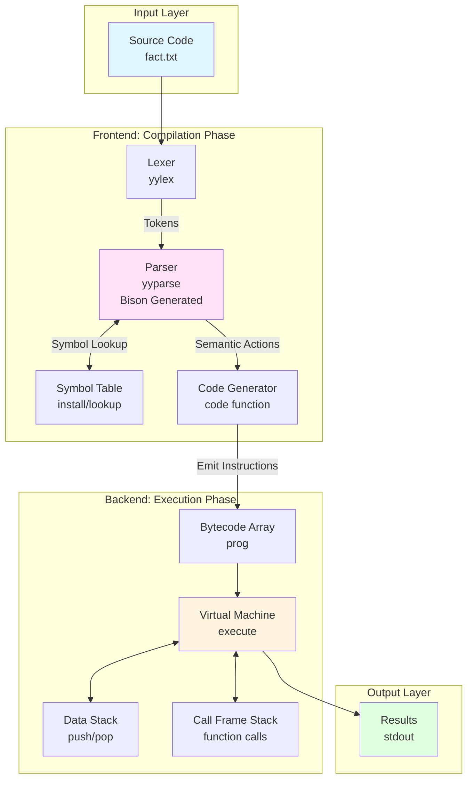

### Memory Layout

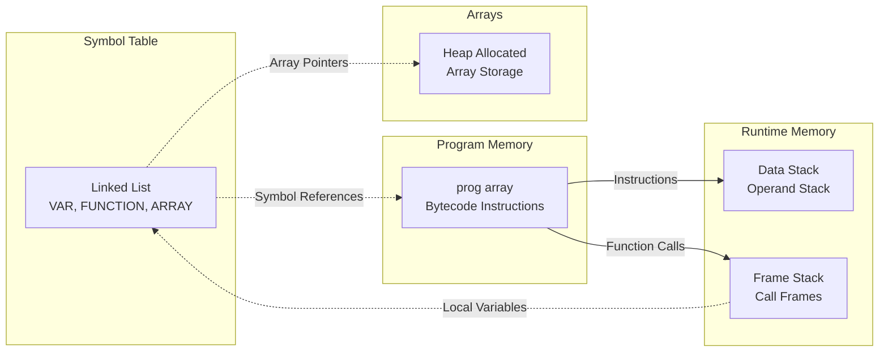

### Two-Phase Execution Model

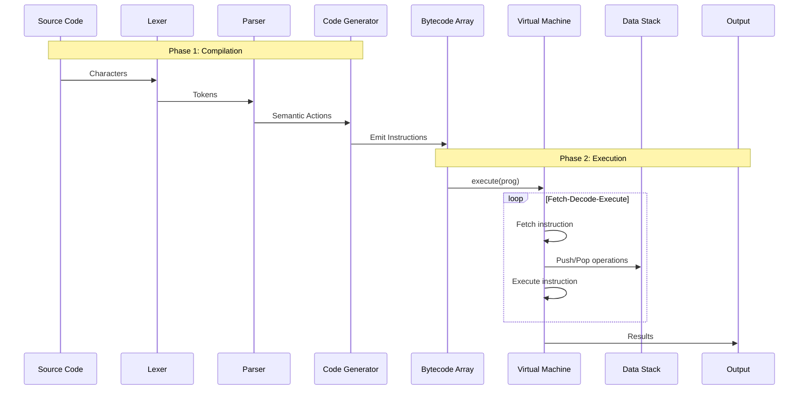

---

## Components and Responsibilities

### 1. Lexer (yylex in hoc.y)

**Responsibility**: Convert character stream into tokens

**Functions**:
- Skip whitespace (space, tab)
- Recognize numbers (integers and floating-point)
- Recognize identifiers (variables, functions, keywords)
- Handle two-character operators (>=, ==, !=, <=, &&, ||, ++, --)
- Process comments (`//`)
- Parse string literals (quoted text)
- Handle parameter references (`$1`, `$2`, ...)
- System commands (`sys-command`)

**Token Types Returned**:
- `NUMBER` - Numeric literals
- `VAR` - Variables
- `FUNCTION` - User-defined functions
- `PROCEDURE` - Void functions
- `ARRAY` - Array variables
- `ARG` - Parameter references ($1, $2, ...)
- `STRING` - String literals
- Keywords: `IF`, `ELSE`, `WHILE`, `FOR`, `PRINT`, `RETURN`, etc.
- Operators: `GT`, `GE`, `LT`, `LE`, `EQ`, `NE`, `AND`, `OR`, `NOT`, `INC`, `DEC`

### 2. Parser (yyparse - Bison Generated)

**Responsibility**: Validate syntax and generate bytecode

**Key Grammar Rules**:
- `list` - Top-level statements
- `defn` - Function/procedure definitions
- `asgn` - Assignments
- `stmt` - Statements (expr, if, while, for, return, print)
- `expr` - Expressions (arithmetic, logical, function calls)
- `cond` - Conditions for control flow
- `array` - Array declarations

**Semantic Actions**: Emit bytecode instructions via `code()` function

### 3. Symbol Table (symbol.c)

**Responsibility**: Store and retrieve named entities

**Data Structure**: Singly-linked list (LIFO insertion)

**Symbol Types**:
```c
typedef struct symbol {
    char *name;           // "x", "factorial", "numbers"
    short type;           // VAR, FUNCTION, PROCEDURE, ARRAY, CNST, BLTIN, etc.
    union {
        double val;       // For variables/constants
        double (*ptr)();  // For built-in functions
        Inst *defn;       // For user functions (bytecode pointer)
        char *str;        // For strings
        double *arrptr;   // For arrays
    } u;
    struct symbol *next;  // Linked list pointer
} symbol;
```

**Operations**:
- `install(name, type, value)` - Add new symbol (returns pointer)
- `lookup(name)` - Find symbol by name (returns NULL if not found)

### 4. Code Generator (code.c)

**Responsibility**: Emit bytecode instructions

**Key Function**:
```c
Inst *code(Inst f)  // Append instruction, return pointer for backpatching
```

**Global State**:
- `prog` - Program array (dynamically resizable)
- `progp` - Current program counter (next free slot)
- `progbase` - Start of current subprogram
- `pc` - Execution program counter

### 5. Virtual Machine (code.c: execute)

**Responsibility**: Execute bytecode instructions

**Core Execution Loop**:
```c
int execute(Inst *p) {
    for (pc = p; *pc != STOP && !returning; ) {
        if (*pc == breakcode) return B;
        else if (*pc == contcode) return C;
        int check = (*(*pc++))();
        if (check == B) return B;
        else if (check == C) return C;
    }
    return 2;
}
```

**Mechanism**:
- Each instruction is a function pointer
- `*pc` dereferences to get function pointer
- `(*pc++)()` calls the function and advances PC
- Functions manipulate the stack and return status codes

### 6. Data Stack (code.c)

**Responsibility**: Store intermediate values during computation

**Structure**:
```c
typedef union Datum {
    double val;    // Numeric values
    symbol *sym;   // Symbol references
} Datum;

static Datum *stack;     // Stack array (dynamically resizable)
static Datum *stackp;    // Stack pointer (next free slot)
```

**Operations**:
- `push(d)` - Push datum onto stack
- `pop()` - Pop datum from stack

### 7. Frame Stack (code.c)

**Responsibility**: Manage function call state

**Structure**:
```c
typedef struct Frame {
    symbol *sp;       // Function symbol pointer
    Inst *retpc;      // Return address (program counter)
    Datum *argn;      // Pointer to arguments on data stack
    int nargs;        // Number of arguments
    symbol *local;    // Local variable array
    int currstatus;   // Number of local variables
} Frame;

static Frame *frame;  // Frame stack array
static Frame *fp;     // Current frame pointer
```

**Operations**:
- `call()` - Create new frame, execute function
- `ret()` - Destroy frame, return to caller
- `funcret()` - Return with value
- `procret()` - Return without value

---

## Lexer and Parser Processing

### Lexer State Machine

The lexer (`yylex`) implements a character-by-character state machine:

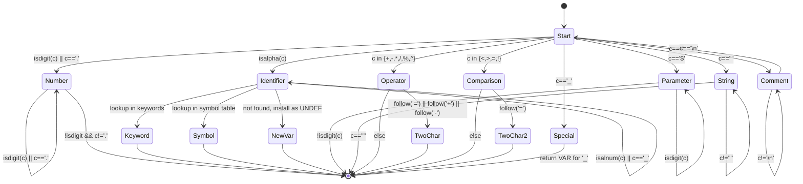

### Lexer Examples

#### Example 1: Number Recognition
**Input**: `3.14159`
**Process**:
1. Read '3' → `isdigit(3)` → enter number state
2. Use `fscanf(fin, "%lf", &d)` to read complete number
3. Install in symbol table: `install("", NUMBER, 3.14159)`
4. Set `yylval.sym` to symbol pointer
5. Return `NUMBER` token

#### Example 2: Identifier Recognition
**Input**: `factorial`
**Process**:
1. Read 'f' → `isalpha('f')` → enter identifier state
2. Accumulate: `factorial`
3. Encounter non-alphanumeric → exit identifier state
4. Lookup: `lookup("factorial")`
5. If found: return symbol's type (VAR, FUNCTION, PROCEDURE)
6. If not found: `install("factorial", UNDEF, 0.0)`, return `VAR`

#### Example 3: Two-Character Operator
**Input**: `>=`
**Process**:
1. Read '>' → enter operator state
2. Call `follow('=', GE, GT)`
3. `getc(fin)` → '='
4. Match found → return `GE` token
5. If no match, `ungetc` and return `GT`

#### Example 4: Parameter Reference
**Input**: `$2`
**Process**:
1. Read '$' → enter parameter state
2. Read digits: '2'
3. Convert to integer: `n = 2`
4. Set `yylval.narg = 2`
5. Return `ARG` token

### Parser Shift-Reduce Actions and State Machine

#### What is LALR(1) Parsing?

Bison generates an **LALR(1) parser** - a sophisticated state machine that makes parsing decisions using:

- **L** = Left-to-right scanning (reads tokens from left to right)
- **A** = Rightmost derivation in reverse
- **LR** = Left-to-right scan with rightmost derivation
- **1** = Looks ahead 1 token to make decisions

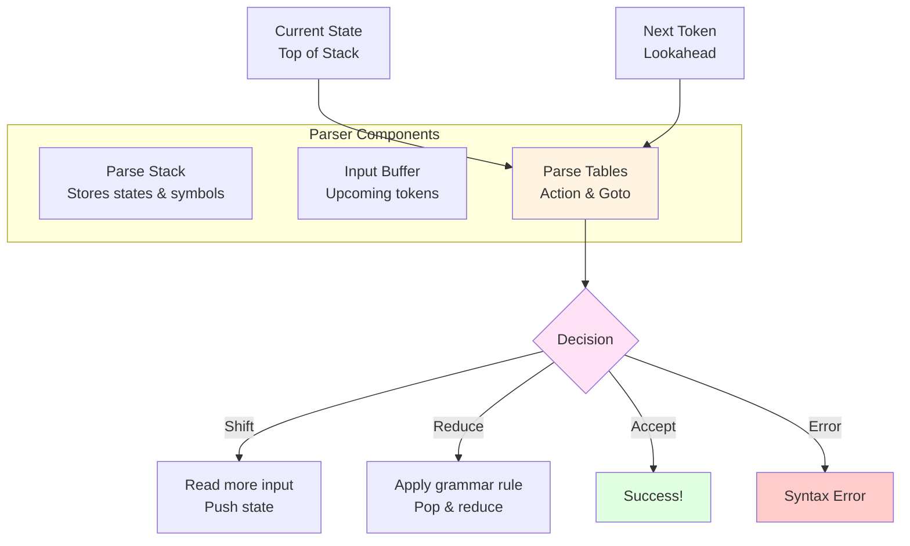

#### The Two Parse Tables

Bison generates two tables that control all parsing decisions:

**1. Action Table**: What to do based on current state + next token
- **Shift (sN)**: Read the token, push it and go to state N
- **Reduce (rN)**: Apply grammar rule N
- **Accept**: Parsing complete successfully
- **Error**: Invalid syntax

**2. Goto Table**: Which state to enter after reducing a non-terminal

#### Operator Precedence (Low to High)

```yacc
%right '='          // Assignment (right-associative)
%left OR            // Logical OR
%left AND           // Logical AND
%left GT GE LT LE EQ NE INC DEC  // Comparison
%left '+' '-'       // Addition, subtraction
%left '*' '/' '%'   // Multiplication, division, modulo
%left UNARYMINUS NOT // Unary operators
%right '^'          // Exponentiation (right-associative)
```

These declarations affect the state machine generation and shift-reduce decisions.

#### Shift vs Reduce Decision

The parser constantly chooses: **Should I shift (read more) or reduce (apply a rule)?**

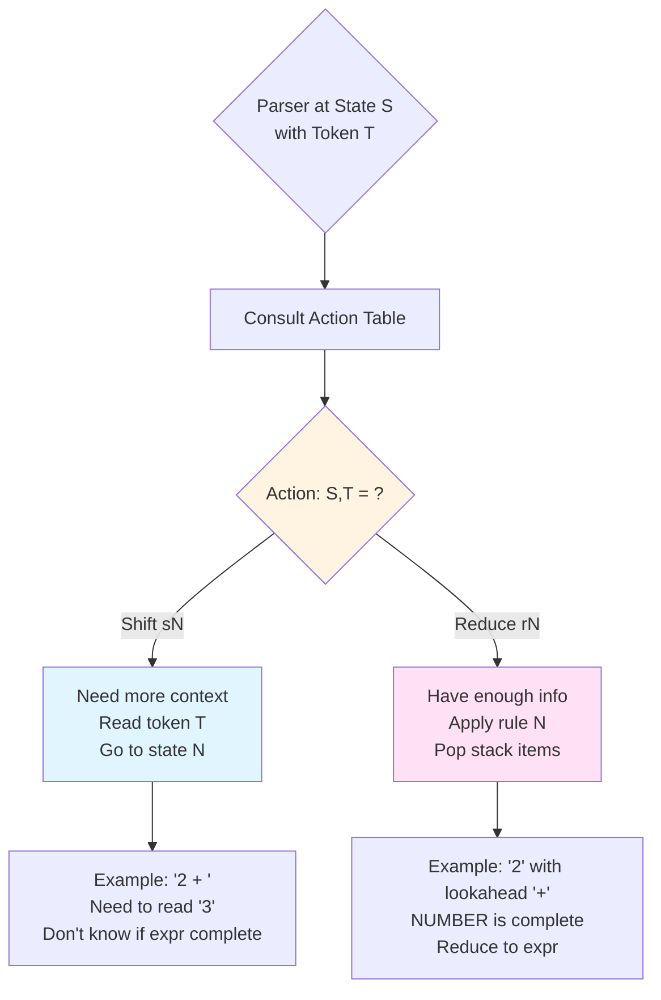

#### Precedence and Shift-Reduce Conflicts

Consider parsing `2 + 3 * 4`. After seeing `2 + 3`, should we:
- **Reduce** `2 + 3` to get `5 * 4`? (Wrong! = 20)
- **Shift** `*` to get `2 + 12`? (Correct! = 14)

Precedence declarations tell the parser: **`*` binds tighter than `+`, so SHIFT!**

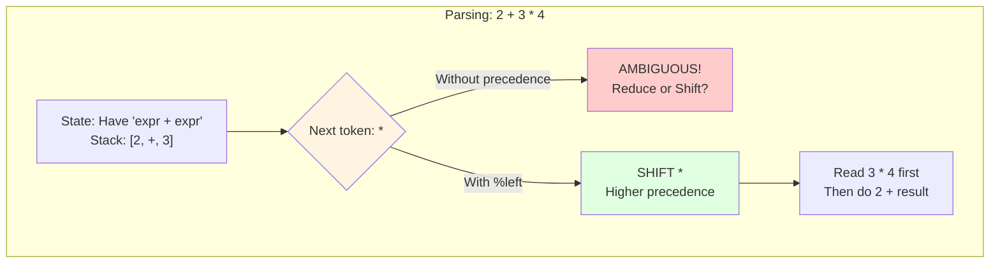

#### State Machine Overview

The LALR(1) state machine has states representing "partial understanding" of input:

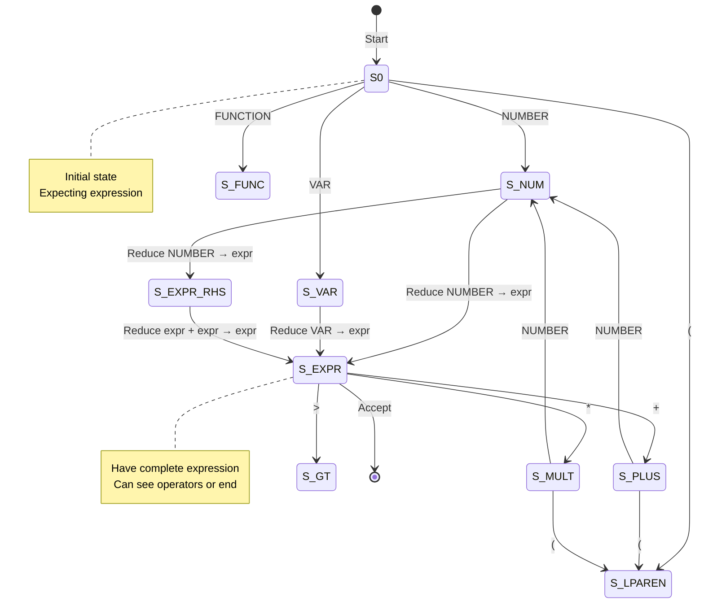

Each state knows what's been seen and what can come next.

#### Example: Parsing `2 + 3 * 4`

**Parse Stack Evolution**:

```
Step 1: Shift NUMBER(2)
Stack: [NUMBER(2)]
Action: Reduce expr → NUMBER
Stack: [expr]

Step 2: Shift '+'
Stack: [expr, +]

Step 3: Shift NUMBER(3)
Stack: [expr, +, NUMBER(3)]
Action: Reduce expr → NUMBER
Stack: [expr, +, expr]

Step 4: Shift '*'
Stack: [expr, +, expr, *]
(Cannot reduce expr+expr yet due to * having higher precedence)

Step 5: Shift NUMBER(4)
Stack: [expr, +, expr, *, NUMBER(4)]
Action: Reduce expr → NUMBER
Stack: [expr, +, expr, *, expr]

Step 6: Reduce expr → expr * expr (higher precedence)
Stack: [expr, +, expr]
Semantic Action: code(mul)

Step 7: Reduce expr → expr + expr
Stack: [expr]
Semantic Action: code(add)
```

**Generated Bytecode**:
```
constpush(2)
constpush(3)
constpush(4)
mul          // 3 * 4
add          // 2 + result
```

#### Detailed State-by-State Trace: `2 + 3 * 4`

Let's trace the complete parsing process with state numbers and table lookups:

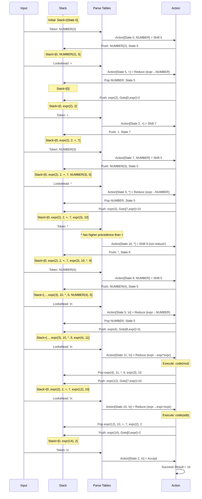

**Key Observations**:
1. **Step 7-8**: When we have `expr + expr` and see `*`, we **SHIFT** (not reduce) because `*` has higher precedence
2. **Step 11**: After completing `expr * expr`, we **REDUCE** to create result of multiplication
3. **Step 12**: Finally reduce `expr + expr` to get final answer

#### Why This Trace Matters

This shows how the state machine **uses precedence** to make correct decisions:

```
At state 10 with "expr + expr" on stack:

If lookahead is \n:  REDUCE (lower precedence, finish +)
If lookahead is *:   SHIFT  (higher precedence, do * first)
If lookahead is +:   REDUCE (same precedence, left-assoc)
```

#### The Parse Stack Structure

The parse stack alternates between **symbols** and **states**:

```
Bottom                                                        Top
┌─────┬────────┬─────┬───┬─────┬────────┬─────┬───┬─────┬────────┬──────┐
│  0  │ expr(2)│  2  │ + │  7  │ expr(3)│ 10  │ * │  9  │ NUMBER │  5   │
└─────┴────────┴─────┴───┴─────┴────────┴─────┴───┴─────┴────────┴──────┘
  ^       ^       ^     ^   ^       ^       ^     ^   ^      ^        ^
  │       │       │     │   │       │       │     │   │      │        │
State  Symbol   State Sym State Symbol  State Sym State Symbol   State
```

**States** track "where we are in the grammar"
**Symbols** track "what we've seen"

#### Example: Parsing `if (x > 5) print x`

**Parse Stack Evolution**:

```
Step 1: Shift IF
Stack: [IF]
Semantic Action: $$ = code(ifcode); code3(STOP,STOP,STOP);
Generated: [ifcode, STOP, STOP, STOP] at positions [N, N+1, N+2, N+3]

Step 2: Parse condition: (x > 5)
Stack: [IF, (, expr, >, expr, )]
Semantic Actions:
  - varpush(x)
  - constpush(5)
  - gt
  - code(STOP)

Step 3: Parse statement: print x
Semantic Action: code(prexpr)

Step 4: Reduce if → IF cond stmt end
Backpatch:
  - ($1)[1] = stmt_addr  // Fill in STOP at N+1
  - ($1)[3] = end_addr   // Fill in STOP at N+3
```

**Generated Bytecode**:
```
Position N:   ifcode
Position N+1: <stmt_addr>    // Backpatched
Position N+2: NULL           // No else clause
Position N+3: <end_addr>     // Backpatched
Position N+4: varpush(x)     // Condition code
Position N+5: constpush(5)
Position N+6: gt
Position N+7: STOP
Position N+8: varpush(x)     // Statement code
Position N+9: eval
Position N+10: prexpr
Position N+11: STOP
Position N+12: <next stmt>
```

#### Associativity in the State Machine

Associativity determines how operators of **same precedence** are grouped:

**Left-Associative** (`%left`): `a - b - c` = `(a - b) - c`
**Right-Associative** (`%right`): `a = b = c` = `a = (b = c)`

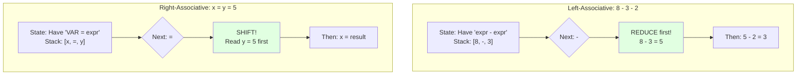

The state machine **encodes associativity** in the action table:
- **Left-associative**: Action says "REDUCE when you see same operator again"
- **Right-associative**: Action says "SHIFT when you see same operator again"

#### How Bison Generates the State Machine

When you run `bison hoc.y`, it:

1. **Analyzes the grammar** to find all possible parser states
2. **Builds LR(0) items** representing partial rules:
   ```
   expr → expr • + expr    (• = current position)
   expr → expr + • expr
   expr → expr + expr •
   ```

3. **Creates state transitions** based on seeing tokens
4. **Resolves conflicts** using precedence/associativity
5. **Generates C code** with state tables:
   ```c
   // In hoc.tab.c
   static const yytype_uint16 yytable[] = { /* 1000s of entries */ };
   static const yytype_int16 yycheck[] = { /* validation data */ };
   static const yytype_uint8 yystos[] = { /* state info */ };
   ```

6. **Compiles parsing loop**:
   ```c
   int yyparse(void) {
       // 500+ lines of generated state machine code
       while (1) {
           yyn = yypact[yystate];  // Look up action
           if (yyn == YYPACT_NINF) goto yydefault;
           // ... shift/reduce decisions ...
       }
   }
   ```

#### State Machine Summary

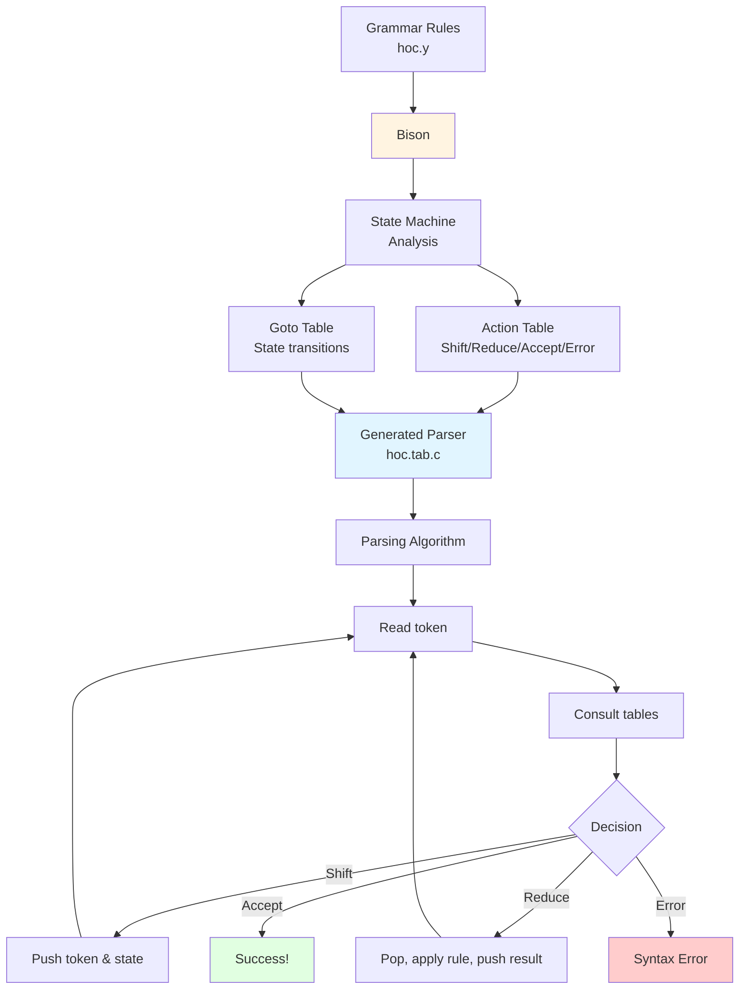

**Key Takeaways**:
1. The parser is a **finite state machine** with ~100-200 states for Vex
2. States represent "partial progress" through grammar rules
3. **Action table** decides shift/reduce based on state + lookahead token
4. **Goto table** decides next state after reductions
5. **Precedence** resolves shift/reduce conflicts
6. **Associativity** determines left-vs-right grouping
7. All this is **automatically generated** from grammar rules!

---

## End-to-End Flow

### Complete Execution Example: Recursive Factorial

**Source Code** (`fact.txt`):
```c
func fact(n) {
    if (n == 0) {
        return 1
    } else {
        return n * fact(n-1)
    }
}
print fact(5)
```

### Phase 1: Lexical Analysis

**Token Stream**:
```
FUNC
VAR(name="fact")
(
VAR(name="n")
)
{
IF
(
VAR(name="n")
EQ
NUMBER(val=0)
)
{
RETURN
NUMBER(val=1)
}
ELSE
{
RETURN
VAR(name="n")
*
FUNCTION(name="fact")
(
VAR(name="n")
-
NUMBER(val=1)
)
}
}
PRINT
FUNCTION(name="fact")
(
NUMBER(val=5)
)
```

### Phase 2: Parsing and Code Generation

**Grammar Rule Matched**:
```
defn: FUNC procname '(' paramlist ')' newl stmt
```

**Semantic Actions Executed**:
```c
// 1. Set function type
$2->type = FUNCTION;
indef = 1;

// 2. After paramlist
code2(cnflush, (Inst)$5);  // Check argument count

// 3. After stmt
code(procret);             // Add return instruction
define($2);                // Save function definition
indef = 0;
```

**Generated Bytecode** (Function Definition):
```
Position 0:  cnflush(1)        // Check 1 parameter
Position 1:  parassgn(n)       // Assign parameter to local
Position 2:  varpush(n)        // if (n == 0)
Position 3:  eval
Position 4:  constpush(0)
Position 5:  eq
Position 6:  STOP
Position 7:  ifcode
Position 8:  <then_addr>       // Backpatched to Position 12
Position 9:  <else_addr>       // Backpatched to Position 16
Position 10: <end_addr>        // Backpatched to Position 24
Position 11: STOP              // (Points to condition)
Position 12: constpush(1)      // return 1
Position 13: funcret
Position 14: STOP
Position 15: <next>
Position 16: varpush(n)        // return n * fact(n-1)
Position 17: eval
Position 18: constpush(1)      // n-1 calculation
Position 19: varpush(n)
Position 20: eval
Position 21: sub
Position 22: call
Position 23: (Inst)fact
Position 24: (Inst)1           // 1 argument
Position 25: mul
Position 26: funcret
Position 27: STOP
Position 28: procret           // End of function
```

**Symbol Table After Parsing**:
```
fact → type=FUNCTION, u.defn=Position 0
n → type=VAR (global), u.val=0
```

### Phase 3: Execution

**Main Program Bytecode**:
```
Position 100: constpush(5)
Position 101: call
Position 102: (Inst)fact
Position 103: (Inst)1          // 1 argument
Position 104: prexpr
Position 105: STOP
```

**Execution Trace**:

```
┌─────────────────────────────────────────────────────────┐
│ Call fact(5)                                            │
└─────────────────────────────────────────────────────────┘

Frame Stack:
┌─────────────────────────────────────────────────────────┐
│ fp[0]: sp=fact, nargs=1, retpc=104, argn→[5]           │
│        local[0] = {name="n", val=5}                     │
└─────────────────────────────────────────────────────────┘

Data Stack: []
pc = Position 0

Execute: cnflush(1) → Check 1 arg passed ✓
Execute: parassgn(n) → Pop 5, create local n=5
Execute: varpush(n) → Push local n symbol
Execute: eval → Push 5
Execute: constpush(0) → Push 0
Execute: eq → Pop 5, 0; push (5==0) = 0
Execute: ifcode → condition=0, go to else branch (Position 16)

Execute: varpush(n) → Push local n symbol
Execute: eval → Push 5
Execute: constpush(1) → Push 1
Execute: varpush(n) → Push local n symbol
Execute: eval → Push 5
Execute: sub → Pop 5, 1; push 4
Execute: call → Call fact with arg 4

┌─────────────────────────────────────────────────────────┐
│ Call fact(4)                                            │
└─────────────────────────────────────────────────────────┘

Frame Stack:
┌─────────────────────────────────────────────────────────┐
│ fp[1]: sp=fact, nargs=1, retpc=Position 25, argn→[4]   │
│        local[0] = {name="n", val=4}                     │
├─────────────────────────────────────────────────────────┤
│ fp[0]: sp=fact, nargs=1, retpc=104, argn→[5]           │
│        local[0] = {name="n", val=5}                     │
└─────────────────────────────────────────────────────────┘

... (recursion continues) ...

┌─────────────────────────────────────────────────────────┐
│ Call fact(0)                                            │
└─────────────────────────────────────────────────────────┘

Frame Stack (depth=6):
┌─────────────────────────────────────────────────────────┐
│ fp[5]: sp=fact, nargs=1, retpc=..., argn→[0]           │
│        local[0] = {name="n", val=0}                     │
├─────────────────────────────────────────────────────────┤
│ ... (4 more frames) ...                                 │
└─────────────────────────────────────────────────────────┘

Execute: varpush(n) → Push local n symbol
Execute: eval → Push 0
Execute: constpush(0) → Push 0
Execute: eq → Pop 0, 0; push 1 (true)
Execute: ifcode → condition=1, go to then branch
Execute: constpush(1) → Push 1
Execute: funcret → Pop 1, ret(), push 1

Frame Stack (depth=5, returned to fact(1)):
Data Stack: [1]

Continue in fact(1):
Execute: mul → Pop 1, 1; push 1*1=1
Execute: funcret → Pop 1, ret(), push 1

... (unwinding continues) ...

Finally, back to main:
Data Stack: [120]
Execute: prexpr → Print 120
```

**Output**: `120`

---

## Code-to-Opcode Translation

### Translation Rules

| Vex Code | Parser Rule | Generated Bytecode | Stack Effect |
|----------|-------------|-------------------|--------------|
| `42` | `NUMBER` | `constpush((Inst)sym)` | → [42] |
| `x` | `VAR` | `varpush((Inst)x), eval` | → [val(x)] |
| `x = 5` | `VAR '=' expr` | `<expr_code>, varpush((Inst)x), assign` | [5] → [5], stores x=5 |
| `a + b` | `expr '+' expr` | `<a_code>, <b_code>, add` | [a,b] → [a+b] |
| `a * b` | `expr '*' expr` | `<a_code>, <b_code>, mul` | [a,b] → [a*b] |
| `-x` | `'-' expr` | `<x_code>, negate` | [x] → [-x] |
| `x > y` | `expr GT expr` | `<x_code>, <y_code>, gt` | [x,y] → [1 or 0] |
| `x && y` | `expr AND expr` | `<x_code>, <y_code>, and_` | [x,y] → [1 or 0] |
| `!x` | `NOT expr` | `<x_code>, not_` | [x] → [!x] |
| `sin(x)` | `BLTIN '(' expr ')'` | `<x_code>, bltin((Inst)sin)` | [x] → [sin(x)] |
| `print x` | `PRINT expr` | `<x_code>, prexpr` | [x] → [], prints x |
| `arr[i]` | `ARRAY '[' expr ']'` | `<i_code>, arrpop((Inst)arr)` | [i] → [arr[i]] |
| `arr[i] = x` | `ARRAY '[' expr ']' '=' expr` | `<i_code>, <x_code>, arrpush((Inst)arr)` | [i,x] → [x], stores |
| `foo(a,b)` | `FUNCTION '(' arglist ')'` | `<a_code>, <b_code>, call((Inst)foo, (Inst)2)` | [a,b] → [result] |
| `$1` | `ARG` | `arg((Inst)1)` | → [param1] |
| `$2 = x` | `ARG '=' expr` | `<x_code>, argassign((Inst)2)` | [x] → [x], stores |
| `read()` | `READ '(' ')'` | `varread` | → [input] |
| `len(arr)` | `ARRLEN '(' ARRAY ')'` | `arrlen((Inst)arr)` | → [length] |

### Control Flow Translation

#### While Loop
**Code**:
```c
while (x < 10) {
    x = x + 1
}
```

**Bytecode Structure**:
```
Position N:   whilecode
Position N+1: <body_addr>      // Backpatched to N+7
Position N+2: <end_addr>       // Backpatched to N+14
Position N+3: varpush(x)       // Condition
Position N+4: eval
Position N+5: constpush(10)
Position N+6: lt
Position N+7: STOP
Position N+8: varpush(x)       // Body
Position N+9: eval
Position N+10: constpush(1)
Position N+11: add
Position N+12: varpush(x)
Position N+13: assign
Position N+14: pop
Position N+15: STOP
Position N+16: <next stmt>
```

**Execution**:
```c
int whilecode() {
    Datum d;
    Inst *savepc = pc;  // savepc = N+1
    while (1) {
        execute(savepc+2);  // Execute condition (N+3 to N+7)
        d = pop();
        if (d.val == 0) break;

        int check = execute(*((Inst **)(savepc)));  // Execute body (N+8 to N+14)
        if (check == B) break;
        else if (check == C) continue;
    }
    pc = *((Inst **)(savepc+1));  // Jump to end (N+16)
    return 2;
}
```

#### If-Else Statement
**Code**:
```c
if (x > 0) {
    print "positive"
} else {
    print "negative"
}
```

**Bytecode Structure**:
```
Position N:   ifcode
Position N+1: <then_addr>      // Backpatched to N+8
Position N+2: <else_addr>      // Backpatched to N+11
Position N+3: <end_addr>       // Backpatched to N+14
Position N+4: varpush(x)       // Condition
Position N+5: eval
Position N+6: constpush(0)
Position N+7: gt
Position N+8: STOP
Position N+9: prstr("positive")  // Then branch
Position N+10: STOP
Position N+11: prstr("negative") // Else branch
Position N+12: STOP
Position N+13: <next stmt>
```

#### For Loop
**Code**:
```c
for (i = 0; i < 10; i++) {
    print i
}
```

**Bytecode Structure**:
```
Position N:   forcode
Position N+1: <init_addr>      // Backpatched to N+6
Position N+2: <cond_addr>      // Backpatched to N+10
Position N+3: <incr_addr>      // Backpatched to N+15
Position N+4: <body_addr>      // Backpatched to N+19
Position N+5: <end_addr>       // Backpatched to N+22
Position N+6: constpush(0)     // Init: i=0
Position N+7: varpush(i)
Position N+8: assign
Position N+9: STOP
Position N+10: varpush(i)      // Condition: i<10
Position N+11: eval
Position N+12: constpush(10)
Position N+13: lt
Position N+14: STOP
Position N+15: varpush(i)      // Increment: i++
Position N+16: eval
Position N+17: constpush(1)
Position N+18: add
Position N+19: varpush(i)
Position N+20: assign
Position N+21: STOP
Position N+22: varpush(i)      // Body: print i
Position N+23: eval
Position N+24: prexpr
Position N+25: STOP
Position N+26: <next stmt>
```

### Function Definition Translation

**Code**:
```c
func add(a, b) {
    return a + b
}
```

**Parser Rule**:
```yacc
defn: FUNC procname {$2->type = FUNCTION; indef = 1;}
      '(' paramlist ')' {code2(cnflush,(Inst)$5);}
      newl stmt
      {code(procret); define($2); indef = 0;}
```

**Bytecode Generated**:
```
Position 0:  cnflush(2)        // Verify 2 arguments passed
Position 1:  parassgn(b)       // Pop arg2, create local b
Position 2:  parassgn(a)       // Pop arg1, create local a
Position 3:  varpush(a)        // return a + b
Position 4:  eval
Position 5:  varpush(b)
Position 6:  eval
Position 7:  add
Position 8:  funcret           // Pop result, ret(), push result
Position 9:  procret           // Default return (if no explicit return)
```

**Symbol Table Entry**:
```c
add → type=FUNCTION, u.defn=(Inst *)Position 0
```

**Function Call**: `add(3, 5)`

**Bytecode**:
```
constpush(3)
constpush(5)
call
(Inst)add
(Inst)2  // 2 arguments
```

**Execution**:
1. Push 3 onto stack
2. Push 5 onto stack
3. `call()` instruction:
   - Create new frame: `fp++`
   - `fp->sp = add`
   - `fp->nargs = 2`
   - `fp->retpc = <next instruction>`
   - `fp->argn = stackp - 1` (points to 5)
   - Allocate locals: `fp->local = calloc(2, sizeof(symbol))`
   - Execute: `execute(add->u.defn)` (Position 0)
4. Execute function body:
   - `cnflush(2)` → verify 2 args
   - `parassgn(b)` → pop 5, create local b=5
   - `parassgn(a)` → pop 3, create local a=3
   - Compute a+b → push 8
   - `funcret()` → pop 8, destroy frame, push 8
5. Continue with next instruction, stack contains [8]

---

## Language Grammar and Examples

### Complete BNF Grammar

```bnf
<list>     ::= ε
             | <list> '\n'
             | <list> <defn> '\n'
             | <list> <asgn> '\n'
             | <list> <stmt> '\n'
             | <list> <expr> '\n'
             | <list> error '\n'

<defn>     ::= FUNC <procname> '(' <paramlist> ')' '\n' <stmt>
             | PROC <procname> '(' <paramlist> ')' '\n' <stmt>

<procname> ::= VAR | FUNCTION | PROCEDURE | ARRAY

<paramlist>::= ε
             | VAR
             | VAR ',' <paramlist>

<asgn>     ::= VAR '=' <expr>
             | ARRAY '[' <expr> ']' '=' <expr>
             | ARG '=' <expr>

<stmt>     ::= <expr>
             | <array>
             | RETURN
             | RETURN <expr>
             | PROCEDURE '(' <arglist> ')'
             | PRINT <prlist>
             | BREAK
             | CONTINUE
             | WHILE <cond> '\n' <stmt>
             | IF <cond> '\n' <stmt>
             | IF <cond> '\n' <stmt> ELSE '\n' <stmt>
             | FOR '(' <fexpr> ';' <fexpr> ';' <fexpr> ')' '\n' <stmt>
             | '{' <stmtlist> '}'

<array>    ::= ARR VAR '[' <expr> ']'
             | ARR VAR '[' ']' '=' '[' <arglist> ']'

<cond>     ::= '(' <expr> ')'

<stmtlist> ::= ε
             | <stmtlist> '\n'
             | <stmtlist> <stmt> '\n'

<fexpr>    ::= <expr>

<prlist>   ::= <expr>
             | STRING
             | <prlist> ',' <expr>
             | <prlist> ',' STRING

<expr>     ::= NUMBER
             | VAR
             | VAR INC
             | VAR DEC
             | ARG
             | CNST
             | <asgn>
             | FUNCTION '(' <arglist> ')'
             | ARRAY '[' <expr> ']'
             | BLTIN '(' <expr> ')'
             | BLTIN2 '(' <expr> ',' <expr> ')'
             | BLTIN0 '(' ')'
             | READ '(' ')'
             | ARRLEN '(' ARRAY ')'
             | <expr> '+' <expr>
             | <expr> '-' <expr>
             | <expr> '*' <expr>
             | <expr> '/' <expr>
             | <expr> '%' <expr>
             | <expr> '^' <expr>
             | '(' <expr> ')'
             | '-' <expr>
             | <expr> GT <expr>
             | <expr> GE <expr>
             | <expr> LT <expr>
             | <expr> LE <expr>
             | <expr> EQ <expr>
             | <expr> NE <expr>
             | <expr> AND <expr>
             | <expr> OR <expr>
             | NOT <expr>

<arglist>  ::= ε
             | <expr>
             | <arglist> ',' <expr>
```

### Grammar Examples with Translation

#### Example 1: Variable Declaration and Assignment
**Code**:
```c
x = 10
y = x * 2
```

**Parse Tree**:
```
asgn → VAR '=' expr
       x    =   (NUMBER)
                  10

asgn → VAR '=' expr
       y    =   (expr '*' expr)
                 VAR     NUMBER
                 x       2
```

**Bytecode**:
```
// x = 10
constpush(10)
varpush(x)
assign
prevset
pop

// y = x * 2
varpush(x)
eval
constpush(2)
mul
varpush(y)
assign
prevset
pop
```

#### Example 2: Function with Recursion
**Code**:
```c
func power(base, exp) {
    if (exp == 0) {
        return 1
    } else {
        return base * power(base, exp-1)
    }
}
```

**Parse Tree**:
```
defn → FUNC procname '(' paramlist ')' stmt
              power      base,exp       (if-else)
```

**Bytecode** (Function Body):
```
Position 0:  cnflush(2)
Position 1:  parassgn(exp)
Position 2:  parassgn(base)
Position 3:  varpush(exp)
Position 4:  eval
Position 5:  constpush(0)
Position 6:  eq
Position 7:  STOP
Position 8:  ifcode
Position 9:  <then_addr>
Position 10: <else_addr>
Position 11: <end_addr>
Position 12: STOP
// Then branch
Position 13: constpush(1)
Position 14: funcret
Position 15: STOP
// Else branch
Position 16: varpush(base)
Position 17: eval
Position 18: varpush(base)
Position 19: eval
Position 20: varpush(exp)
Position 21: eval
Position 22: constpush(1)
Position 23: sub
Position 24: call
Position 25: (Inst)power
Position 26: (Inst)2
Position 27: mul
Position 28: funcret
Position 29: STOP
Position 30: procret
```

#### Example 3: Array Operations
**Code**:
```c
arr numbers[5]
numbers[0] = 10
numbers[1] = 20
x = numbers[0] + numbers[1]
```

**Parse Tree**:
```
array → ARR VAR '[' expr ']'
             numbers  5

asgn → ARRAY '[' expr ']' '=' expr
       numbers   0          10

expr → expr '+' expr
       ARRAY[0]  ARRAY[1]
```

**Bytecode**:
```
// arr numbers[5]
constpush(5)
arrinit(numbers)

// numbers[0] = 10
constpush(0)
constpush(10)
arrpush(numbers)

// numbers[1] = 20
constpush(1)
constpush(20)
arrpush(numbers)

// x = numbers[0] + numbers[1]
constpush(0)
arrpop(numbers)
constpush(1)
arrpop(numbers)
add
varpush(x)
assign
```

#### Example 4: Nested Loops
**Code**:
```c
for (i = 0; i < 3; i++) {
    for (j = 0; j < 3; j++) {
        print i * j
    }
}
```

**Bytecode Structure**:
```
// Outer for loop
forcode
<init: i=0>
<cond: i<3>
<incr: i++>
<body: inner loop>
<end>

    // Inner for loop (body of outer)
    forcode
    <init: j=0>
    <cond: j<3>
    <incr: j++>
    <body: print i*j>
    <end>
```

---

## Function Implementation

### Frame Stack Architecture

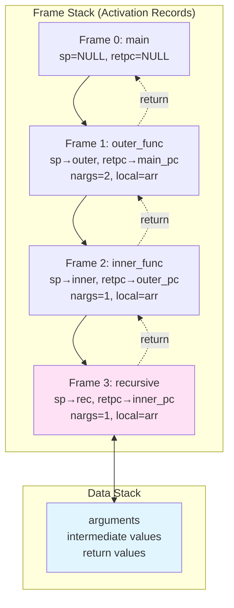

### Frame Structure Details

```c
typedef struct Frame {
    symbol *sp;       // Function symbol (name, type, definition)
    Inst *retpc;      // Return address (where to continue after return)
    Datum *argn;      // Pointer to last argument on data stack
    int nargs;        // Number of arguments passed
    symbol *local;    // Array of local variables (parameters)
    int currstatus;   // Number of locals currently defined
} Frame;
```

**Memory Layout**:
```
Frame Stack:              Data Stack:
┌─────────────────┐      ┌─────────────────┐
│ fp[2]           │      │ arg1 for fp[2]  │
│ sp = func3      │      │ arg2 for fp[2]  │
│ nargs = 2       │◄─────│ ... ← fp[2]->argn
│ retpc = ...     │      │ arg1 for fp[1]  │
│ local = [...]   │      │ arg2 for fp[1]  │
├─────────────────┤      │ arg3 for fp[1]  │
│ fp[1]           │      │ ... ← fp[1]->argn
│ sp = func2      │◄─────┤                 │
│ nargs = 3       │      │ arg1 for fp[0]  │
│ retpc = ...     │      │ ... ← fp[0]->argn
│ local = [...]   │      └─────────────────┘
├─────────────────┤
│ fp[0]           │
│ sp = func1      │◄─────┐
│ nargs = 1       │      │
│ retpc = main    │      │
│ local = [...]   │      │
└─────────────────┘      │
         ▲               │
         │               │
         fp              │
                      stackp
```

### Argument Handling

#### Positional Argument Access (`$1`, `$2`, ...)

**Code**:
```c
func example(a, b, c) {
    return $1 + $2 + $3
}
```

**Mechanism**:
```c
double *getarg() {
    int nargs = (int)*pc++;  // Get argument number from bytecode
    if (nargs > fp->nargs) execerror(fp->sp->name, "not enough arguments");
    return &fp->argn[nargs - fp->nargs].val;
}

int arg() {
    Datum d;
    d.val = *getarg();  // Read argument value
    push(d);
    return 2;
}
```

**Data Stack Layout** for `example(10, 20, 30)`:
```
Before call():
┌──────┐
│  30  │ ← stackp (top)
├──────┤
│  20  │
├──────┤
│  10  │
└──────┘

After call() creates frame:
fp->nargs = 3
fp->argn points to top (30)

Accessing $1: argn[1-3] = argn[-2] → 10
Accessing $2: argn[2-3] = argn[-1] → 20
Accessing $3: argn[3-3] = argn[0]  → 30
```

#### Named Parameter Assignment

**Code**:
```c
func add(a, b) {
    return a + b
}
```

**Parameter Processing**:
```yacc
paramlist: VAR ',' paramlist {$$ = $3 + 1; code2(parassgn, (Inst)$1);}
```

**Execution** (`parassgn`):
```c
int parassgn() {
    symbol *sp = (symbol *)(*pc++);  // Get parameter name
    Datum d = pop();                 // Pop argument from stack

    // Store in local variable array
    (fp->local)[fp->currstatus].u.val = d.val;

    // Copy name
    int size = strlen(sp->name) + 1;
    (fp->local)[fp->currstatus].name = malloc(size);
    strcpy((fp->local)[fp->currstatus].name, sp->name);

    (fp->local)[fp->currstatus].type = VAR;
    fp->currstatus++;
    return 2;
}
```

**Result**: Parameters become local variables in `fp->local[]` array

### Scoping Rules

#### Scope Resolution

When `varpush(name)` is executed:
```c
int varpush() {
    Datum d;
    symbol *sp = (symbol *)(*pc++);  // Global symbol from symbol table
    d.sym = sp;  // Default to global

    // If inside function call, search local variables
    if (fp > frame && fp->nargs > 0) {
        for (int i = 0; i < fp->currstatus; i++) {
            if (fp->local[i].name && strcmp(fp->local[i].name, sp->name) == 0) {
                d.sym = &(fp->local)[i];  // Override with local
                break;
            }
        }
    }

    if (*pc != assign && d.sym->type == UNDEF)
        execerror("is not defined", d.sym->name);
    push(d);
    return 2;
}
```

#### Scope Example

**Code**:
```c
x = 100  // Global x

func test(x) {
    print x         // Prints parameter x (local)
    x = x + 1       // Modifies local x
    print x
    return x
}

result = test(5)    // Passes 5
print x             // Prints 100 (global unchanged)
print result        // Prints 6 (return value)
```

**Execution**:
```
Symbol Table (global):
x → type=VAR, u.val=100
test → type=FUNCTION, u.defn=...

Call test(5):
┌───────────────────────────────┐
│ Frame[1]:                     │
│   sp = test                   │
│   nargs = 1                   │
│   local[0] = {name="x", val=5}│
└───────────────────────────────┘

First print x:
  - varpush(x) searches locals
  - Finds local[0].name == "x"
  - Uses local[0].val = 5
  - Output: 5

x = x + 1:
  - Modifies local[0].val
  - local[0].val = 6

Second print x:
  - Output: 6

Return x:
  - Returns local[0].val = 6

Back in main, print x:
  - No active frame (fp == frame)
  - Uses global symbol table
  - Output: 100

Print result:
  - Output: 6
```

### Call Stack Mechanics

#### Function Call Sequence

```c
int call() {
    symbol *s = (symbol *)pc[0];    // Function symbol

    // 1. Create new frame
    if (fp++ >= &frame[nframe - 1]) {
        nframe += 100;
        frame = realloc(frame, nframe * sizeof(Frame));
    }

    // 2. Initialize frame
    fp->sp = s;
    fp->nargs = (int)pc[1];
    fp->retpc = pc + 2;              // Save return address
    fp->argn = stackp - 1;           // Point to top argument
    fp->local = calloc(fp->nargs, sizeof(symbol));  // Allocate locals
    fp->currstatus = 0;

    // 3. Execute function body
    execute(s->u.defn);

    // 4. Cleanup
    returning = 0;
    return 2;
}
```

#### Return Sequence

**For Functions** (`funcret`):
```c
int funcret() {
    Datum d;
    if (fp->sp->type == PROCEDURE)
        execerror(fp->sp->name, "(void) returns value");
    d = pop();    // Pop return value
    ret();        // Cleanup frame
    push(d);      // Push return value back
    return 2;
}
```

**For Procedures** (`procret`):
```c
int procret() {
    if (fp->sp->type == FUNCTION)
        execerror(fp->sp->name, "(func) returns no value");
    ret();        // Cleanup frame (no return value)
    return 2;
}
```

**Common Cleanup** (`ret`):
```c
int ret() {
    // Free local variable names
    for (int i = 0; i < fp->currstatus; i++) {
        if (fp->local[i].name) free(fp->local[i].name);
    }
    free(fp->local);

    // Restore execution context
    pc = (Inst *)fp->retpc;
    --fp;
    returning = 1;
    return 2;
}
```

### Recursion Example

**Code**:
```c
func countdown(n) {
    print n
    if (n > 0) {
        countdown(n-1)
    }
}
countdown(3)
```

**Frame Stack Evolution**:

```
Step 1: Call countdown(3)
┌────────────────────────┐
│ fp[0]: n=3, retpc=main │
└────────────────────────┘
Print: 3
Evaluate n > 0: true
Call countdown(2)

Step 2: Call countdown(2)
┌────────────────────────┐
│ fp[1]: n=2, retpc→fp[0]│
├────────────────────────┤
│ fp[0]: n=3, retpc=main │
└────────────────────────┘
Print: 2
Evaluate n > 0: true
Call countdown(1)

Step 3: Call countdown(1)
┌────────────────────────┐
│ fp[2]: n=1, retpc→fp[1]│
├────────────────────────┤
│ fp[1]: n=2, retpc→fp[0]│
├────────────────────────┤
│ fp[0]: n=3, retpc=main │
└────────────────────────┘
Print: 1
Evaluate n > 0: true
Call countdown(0)

Step 4: Call countdown(0)
┌────────────────────────┐
│ fp[3]: n=0, retpc→fp[2]│
├────────────────────────┤
│ fp[2]: n=1, retpc→fp[1]│
├────────────────────────┤
│ fp[1]: n=2, retpc→fp[0]│
├────────────────────────┤
│ fp[0]: n=3, retpc=main │
└────────────────────────┘
Print: 0
Evaluate n > 0: false
No recursive call, function ends

Step 5: Return from countdown(0)
┌────────────────────────┐
│ fp[2]: n=1, retpc→fp[1]│
├────────────────────────┤
│ fp[1]: n=2, retpc→fp[0]│
├────────────────────────┤
│ fp[0]: n=3, retpc=main │
└────────────────────────┘

Step 6: Return from countdown(1)
┌────────────────────────┐
│ fp[1]: n=2, retpc→fp[0]│
├────────────────────────┤
│ fp[0]: n=3, retpc=main │
└────────────────────────┘

Step 7: Return from countdown(2)
┌────────────────────────┐
│ fp[0]: n=3, retpc=main │
└────────────────────────┘

Step 8: Return from countdown(3)
(Empty frame stack, back to main)

Output:
3
2
1
0
```

---

## Built-in Operators and Functions

### Arithmetic Operators

| Operator | Syntax | Description | Example | Result |
|----------|--------|-------------|---------|--------|
| `+` | `a + b` | Addition | `3 + 4` | `7` |
| `-` | `a - b` | Subtraction | `10 - 3` | `7` |
| `*` | `a * b` | Multiplication | `5 * 6` | `30` |
| `/` | `a / b` | Division | `20 / 4` | `5` |
| `%` | `a % b` | Modulo (integer remainder) | `17 % 5` | `2` |
| `^` | `a ^ b` | Exponentiation | `2 ^ 10` | `1024` |
| `-` | `-a` | Unary negation | `-5` | `-5` |
| `++` | `x++` | Post-increment | `x=5; x++` | `6` |
| `--` | `x--` | Post-decrement | `x=5; x--` | `4` |

### Comparison Operators

| Operator | Syntax | Description | Example | Result |
|----------|--------|-------------|---------|--------|
| `>` | `a > b` | Greater than | `5 > 3` | `1` (true) |
| `>=` | `a >= b` | Greater or equal | `5 >= 5` | `1` (true) |
| `<` | `a < b` | Less than | `3 < 5` | `1` (true) |
| `<=` | `a <= b` | Less or equal | `5 <= 3` | `0` (false) |
| `==` | `a == b` | Equal | `5 == 5` | `1` (true) |
| `!=` | `a != b` | Not equal | `5 != 3` | `1` (true) |

### Logical Operators

| Operator | Syntax | Description | Example | Result |
|----------|--------|-------------|---------|--------|
| `&&` | `a && b` | Logical AND | `1 && 0` | `0` (false) |
| `||` | `a || b` | Logical OR | `1 || 0` | `1` (true) |
| `!` | `!a` | Logical NOT | `!0` | `1` (true) |

**Note**: Non-zero values are considered true, zero is false.

### Mathematical Functions (Single Argument)

| Function | Description | Example | Result |
|----------|-------------|---------|--------|
| `sin(x)` | Sine (radians) | `sin(PI/2)` | `1` |
| `cos(x)` | Cosine (radians) | `cos(0)` | `1` |
| `atan(x)` | Arctangent (degrees) | `atan(1)` | `45` |
| `ln(x)` | Natural logarithm | `ln(E)` | `1` |
| `log(x)` | Base-10 logarithm | `log(100)` | `2` |
| `exp(x)` | Exponential (e^x) | `exp(1)` | `2.718282` |
| `sqrt(x)` | Square root | `sqrt(16)` | `4` |
| `int(x)` | Floor (round down) | `int(3.7)` | `3` |
| `abs(x)` | Absolute value | `abs(-5)` | `5` |

### Mathematical Functions (Two Arguments)

| Function | Description | Example | Result |
|----------|-------------|---------|--------|
| `atan2(y,x)` | Arctangent of y/x (degrees) | `atan2(1,1)` | `45` |

### Mathematical Functions (No Arguments)

| Function | Description | Example | Result (approx) |
|----------|-------------|---------|-----------------|
| `rand()` | Random number [0,1) | `rand()` | `0.347` (varies) |

### Mathematical Constants

| Constant | Description | Value |
|----------|-------------|-------|
| `PI` | Pi (π) | `3.14159265358979323846` |
| `E` | Euler's number (e) | `2.71828182845904523536` |
| `GAMMA` | Euler-Mascheroni constant | `0.57721566490153286060` |
| `DEG` | Radians to degrees (180/π) | `57.29577951308232087680` |
| `PHI` | Golden ratio (φ) | `1.61803398874989484820` |

### Array Functions

| Function | Description | Example |
|----------|-------------|---------|
| `len(arr)` | Get array length | `len(numbers)` |
| `arr name[size]` | Declare array | `arr data[100]` |
| `arr name[] = [...]` | Initialize array | `arr vals[] = [1,2,3,4,5]` |
| `name[index]` | Access element | `data[0]` |
| `name[index] = value` | Set element | `data[0] = 42` |

### I/O Functions

| Function | Description | Example |
|----------|-------------|---------|
| `print expr` | Print expression | `print x` |
| `print string, expr` | Print mixed | `print "Result: ", x` |
| `read()` | Read number from input | `x = read()` |

### Control Flow Keywords

| Keyword | Syntax | Description |
|---------|--------|-------------|
| `if` | `if (cond) stmt` | Conditional execution |
| `else` | `if (cond) stmt else stmt` | Alternative branch |
| `while` | `while (cond) stmt` | Loop while condition true |
| `for` | `for (init; cond; incr) stmt` | Standard for loop |
| `break` | `break` | Exit loop early |
| `continue` | `continue` | Skip to next iteration |

### Function Keywords

| Keyword | Syntax | Description |
|---------|--------|-------------|
| `func` | `func name(params) stmt` | Define function (returns value) |
| `void` | `void name(params) stmt` | Define procedure (no return) |
| `return` | `return expr` | Return value from function |
| `return` | `return` | Return from procedure |

---

## Sample Programs

### 1. Recursive Factorial

```c
// Calculate factorial using recursion
func fact(n) {
    if (n == 0) {
        return 1
    } else {
        return n * fact(n-1)
    }
}

print "Enter number: "
x = read()
print "Factorial of ", x, " is ", fact(x), "\n"
```

**Example Run**:
```
Enter number: 5
Factorial of 5 is 120
```

### 2. Fibonacci Sequence (Iterative)

```c
// Calculate Fibonacci number iteratively
x = 1
y = 1
fib = 1

print "Enter n: "
n = read()

for (i = 2; i < n; i++) {
    fib = x + y
    y = x
    x = fib
}

print "Fibonacci(", n, ") = ", fib, "\n"
```

### 3. Fibonacci Sequence (Recursive)

```c
// Calculate Fibonacci using recursion
func fib(n) {
    if (n <= 1) {
        return n
    } else {
        return fib(n-1) + fib(n-2)
    }
}

print "Enter n: "
x = read()
print "Fibonacci(", x, ") = ", fib(x), "\n"
```

### 4. Bubble Sort

```c
// Sort array using bubble sort
print "Enter array size: "
arr data[read()]

print "Enter elements:\n"
for (i = 0; i < len(data); i++) {
    print "data[", i, "] = "
    data[i] = read()
}

// Bubble sort with helper function
void swap(i, j) {
    temp = data[i]
    data[i] = data[j]
    data[j] = temp
}

for (i = 0; i < len(data); i++) {
    for (j = i+1; j < len(data); j++) {
        if (data[i] > data[j]) {
            swap(i, j)
        }
    }
}

print "Sorted array: "
for (i = 0; i < len(data); i++) {
    print data[i], " "
}
print "\n"
```

### 5. Quicksort (Recursive)

```c
// Quicksort implementation with recursion
arr data[100]
n = 0

// Partition function
func partition(low, high) {
    pivot = data[high]
    i = low - 1

    for (j = low; j < high; j++) {
        if (data[j] < pivot) {
            i = i + 1
            temp = data[i]
            data[i] = data[j]
            data[j] = temp
        }
    }

    temp = data[i+1]
    data[i+1] = data[high]
    data[high] = temp

    return i + 1
}

// Quicksort recursive function
void quicksort(low, high) {
    if (low < high) {
        pi = partition(low, high)
        quicksort(low, pi - 1)
        quicksort(pi + 1, high)
    }
}

// Main program
print "Enter array size: "
n = read()

print "Enter elements:\n"
for (i = 0; i < n; i++) {
    print "data[", i, "] = "
    data[i] = read()
}

quicksort(0, n-1)

print "Sorted array: "
for (i = 0; i < n; i++) {
    print data[i], " "
}
print "\n"
```

### 6. Prime Number Checker

```c
// Check if number is prime
func isPrime(n) {
    if (n <= 1) {
        return 0
    }
    if (n <= 3) {
        return 1
    }
    if (n % 2 == 0 || n % 3 == 0) {
        return 0
    }

    i = 5
    while (i * i <= n) {
        if (n % i == 0 || n % (i+2) == 0) {
            return 0
        }
        i = i + 6
    }
    return 1
}

print "Enter number: "
x = read()

if (isPrime(x)) {
    print x, " is prime\n"
} else {
    print x, " is not prime\n"
}
```

### 7. Greatest Common Divisor (Euclidean Algorithm)

```c
// Calculate GCD using recursion
func gcd(a, b) {
    if (b == 0) {
        return a
    } else {
        return gcd(b, a % b)
    }
}

print "Enter first number: "
a = read()
print "Enter second number: "
b = read()

result = gcd(a, b)
print "GCD(", a, ", ", b, ") = ", result, "\n"
```

### 8. Matrix Operations

```c
// Matrix addition
arr A[9]  // 3x3 matrix
arr B[9]  // 3x3 matrix
arr C[9]  // Result matrix

print "Enter matrix A (3x3):\n"
for (i = 0; i < 9; i++) {
    print "A[", i, "] = "
    A[i] = read()
}

print "Enter matrix B (3x3):\n"
for (i = 0; i < 9; i++) {
    print "B[", i, "] = "
    B[i] = read()
}

// Add matrices
for (i = 0; i < 9; i++) {
    C[i] = A[i] + B[i]
}

print "Result matrix C = A + B:\n"
for (i = 0; i < 3; i++) {
    for (j = 0; j < 3; j++) {
        print C[i*3 + j], " "
    }
    print "\n"
}
```

### 9. Quadratic Equation Solver

```c
// Solve ax^2 + bx + c = 0
print "Enter a: "
a = read()
print "Enter b: "
b = read()
print "Enter c: "
c = read()

void solveQuadratic(a, b, c) {
    discriminant = (b^2) - (4*a*c)

    if (a == 0) {
        print "Not a quadratic equation\n"
        return
    }

    if (discriminant >= 0) {
        x1 = (-b + sqrt(discriminant)) / (2*a)
        x2 = (-b - sqrt(discriminant)) / (2*a)

        print "x1 = ", x1, "\n"
        print "x2 = ", x2, "\n"

        if (x1 == x2) {
            print "Roots are equal\n"
        }
    } else {
        realPart = -b / (2*a)
        imagPart = sqrt(-discriminant) / (2*a)

        print "x1 = ", realPart, " + ", imagPart, "i\n"
        print "x2 = ", realPart, " - ", imagPart, "i\n"
        print "Roots are complex\n"
    }
}

solveQuadratic(a, b, c)
```

### 10. Tower of Hanoi

```c
// Solve Tower of Hanoi puzzle
void hanoi(n, from, to, aux) {
    if (n == 1) {
        print "Move disk 1 from ", from, " to ", to, "\n"
        return
    }

    hanoi(n-1, from, aux, to)
    print "Move disk ", n, " from ", from, " to ", to, "\n"
    hanoi(n-1, aux, to, from)
}

print "Enter number of disks: "
n = read()

print "Solution for ", n, " disks:\n"
hanoi(n, 1, 3, 2)  // From tower 1 to tower 3 using tower 2
```

### 11. Binary Search

```c
// Binary search in sorted array
arr data[100]
n = 0

func binarySearch(target, low, high) {
    if (low > high) {
        return -1  // Not found
    }

    mid = int((low + high) / 2)

    if (data[mid] == target) {
        return mid
    } else {
        if (data[mid] > target) {
            return binarySearch(target, low, mid-1)
        } else {
            return binarySearch(target, mid+1, high)
        }
    }
}

print "Enter array size: "
n = read()

print "Enter sorted elements:\n"
for (i = 0; i < n; i++) {
    print "data[", i, "] = "
    data[i] = read()
}

print "Enter search target: "
target = read()

index = binarySearch(target, 0, n-1)

if (index >= 0) {
    print "Found at index ", index, "\n"
} else {
    print "Not found\n"
}
```

### 12. Statistical Functions

```c
// Calculate mean, variance, and standard deviation
arr data[100]
n = 0

func mean(n) {
    sum = 0
    for (i = 0; i < n; i++) {
        sum = sum + data[i]
    }
    return sum / n
}

func variance(n, avg) {
    sum = 0
    for (i = 0; i < n; i++) {
        diff = data[i] - avg
        sum = sum + (diff ^ 2)
    }
    return sum / n
}

print "Enter number of values: "
n = read()

print "Enter values:\n"
for (i = 0; i < n; i++) {
    print "data[", i, "] = "
    data[i] = read()
}

avg = mean(n)
var = variance(n, avg)
stddev = sqrt(var)

print "Mean: ", avg, "\n"
print "Variance: ", var, "\n"
print "Standard Deviation: ", stddev, "\n"
```

---

## Extension Ideas

### 1. Basic Extensions

#### 1.1 String Type
**Goal**: Add first-class string support

**Tasks**:
- Define `STRING` symbol type in `hoc.h`
- Implement string operations: concatenation, length, substring
- Add string comparison operators
- Modify lexer to handle multi-line strings

**Example Syntax**:
```c
s1 = "Hello"
s2 = " World"
s3 = s1 + s2  // "Hello World"
if (s1 == "Hello") { ... }
```

#### 1.2 Additional Operators
**Goal**: Expand operator set

**Tasks**:
- Bitwise operators: `&`, `|`, `~`, `<<`, `>>`
- Compound assignment: `+=`, `-=`, `*=`, `/=`, `%=`
- Pre-increment/decrement: `++x`, `--x`
- Ternary operator: `cond ? expr1 : expr2`

#### 1.3 More Built-in Functions
**Goal**: Rich standard library

**Tasks**:
- String functions: `strlen()`, `substr()`, `toupper()`, `tolower()`
- Math functions: `tan()`, `sinh()`, `cosh()`, `tanh()`
- Array functions: `sort()`, `reverse()`, `slice()`
- Type conversion: `str()`, `num()`

### 2. Intermediate Extensions

#### 2.1 Multidimensional Arrays
**Goal**: Support 2D and 3D arrays

**Tasks**:
- Extend array syntax: `arr matrix[3][3]`
- Modify `arrinit` to handle multiple dimensions
- Update indexing: `matrix[i][j]`
- Add array slicing

**Example**:
```c
arr matrix[3][3]
matrix[0][0] = 1
matrix[0][1] = 2
```

#### 2.2 Structures/Records
**Goal**: User-defined composite types

**Tasks**:
- Add `struct` keyword
- Implement dot notation for member access
- Support nested structures
- Add structure arrays

**Example**:
```c
struct Point {
    x
    y
}
p = Point{x: 10, y: 20}
print p.x
```

#### 2.3 File I/O
**Goal**: Read/write files

**Tasks**:
- Add `fopen()`, `fclose()`, `fread()`, `fwrite()`
- Implement file handles
- Add error handling for file operations
- Support text and binary modes

**Example**:
```c
f = fopen("data.txt", "r")
while (line = freadline(f)) {
    print line
}
fclose(f)
```

### 3. Advanced Extensions

#### 3.1 Hash Tables/Dictionaries
**Goal**: Associative arrays

**Tasks**:
- Implement hash table data structure
- Add dictionary syntax: `dict d = {key: value}`
- Support arbitrary keys (strings, numbers)
- Add methods: `keys()`, `values()`, `has()`

**Example**:
```c
dict person = {name: "Alice", age: 30}
print person["name"]
person["city"] = "NYC"
```

#### 3.2 Lambda Functions / Anonymous Functions
**Goal**: First-class functions

**Tasks**:
- Add lambda syntax: `func(x) { return x*2 }`
- Allow functions as arguments
- Implement closures (capture outer variables)
- Add higher-order functions: `map()`, `filter()`, `reduce()`

**Example**:
```c
square = func(x) { return x*x }
arr nums[] = [1, 2, 3, 4, 5]
squared = map(nums, square)
```

#### 3.3 Exception Handling
**Goal**: Try-catch error handling

**Tasks**:
- Add `try`, `catch`, `throw` keywords
- Implement exception stack unwinding
- Support error types
- Add `finally` block

**Example**:
```c
try {
    x = 10 / 0
} catch (e) {
    print "Error: ", e
}
```

#### 3.4 Object-Oriented Programming
**Goal**: Classes and inheritance

**Tasks**:
- Add `class` keyword
- Implement constructors and destructors
- Support inheritance with `extends`
- Add `this` keyword
- Implement method dispatch

**Example**:
```c
class Animal {
    func init(name) {
        this.name = name
    }

    func speak() {
        print this.name, " makes a sound"
    }
}

class Dog extends Animal {
    func speak() {
        print this.name, " barks"
    }
}
```

### 4. Optimization Extensions

#### 4.1 Bytecode Optimizer
**Goal**: Optimize generated bytecode

**Tasks**:
- Constant folding: evaluate constant expressions at compile-time
- Dead code elimination: remove unreachable code
- Common subexpression elimination
- Peephole optimization: improve instruction sequences

**Example**:
```c
x = 2 + 3  // Compile to constpush(5) instead of constpush(2),constpush(3),add
```

#### 4.2 JIT Compilation
**Goal**: Just-in-time native code generation

**Tasks**:
- Detect hot loops (frequently executed code)
- Generate x86/ARM assembly for hot code
- Implement code cache
- Add performance profiling

#### 4.3 Garbage Collection
**Goal**: Automatic memory management

**Tasks**:
- Implement mark-and-sweep GC
- Add reference counting for arrays
- Track heap allocations
- Periodic GC runs

### 5. Language Features

#### 5.1 Module System
**Goal**: Code organization and reuse

**Tasks**:
- Add `import` keyword
- Implement module namespaces
- Support relative/absolute imports
- Create standard library modules

**Example**:
```c
import math
import "mylib.vex"

x = math.sqrt(16)
```

#### 5.2 Variadic Functions
**Goal**: Variable number of arguments

**Tasks**:
- Add `...` syntax for varargs
- Implement `argc` and `argv` access
- Support variadic built-ins like `print()`

**Example**:
```c
func sum(...) {
    total = 0
    for (i = 1; i <= argc; i++) {
        total = total + $i
    }
    return total
}

print sum(1, 2, 3, 4, 5)  // 15
```

#### 5.3 Pattern Matching
**Goal**: Advanced control flow

**Tasks**:
- Add `match` keyword
- Support value matching
- Implement type matching
- Add destructuring

**Example**:
```c
match x {
    0 => print "zero"
    1 => print "one"
    _ => print "other"
}
```

### 6. Development Tools

#### 6.1 Debugger
**Goal**: Interactive debugging

**Tasks**:
- Implement breakpoints
- Add step-through execution
- Support variable inspection
- Show call stack and bytecode

**Commands**:
- `break <line>` - set breakpoint
- `step` - execute next instruction
- `continue` - run until breakpoint
- `print <var>` - show variable value

#### 6.2 REPL Improvements
**Goal**: Better interactive experience

**Tasks**:
- Add command history (up/down arrows)
- Implement tab completion
- Show syntax highlighting
- Add multi-line input support

#### 6.3 Bytecode Disassembler
**Goal**: View generated bytecode

**Tasks**:
- Pretty-print bytecode
- Show instruction addresses
- Display constant pool
- Map bytecode to source lines

**Example Output**:
```
0000: constpush(5)
0001: varpush(x)
0002: assign
0003: STOP
```

#### 6.4 Static Type Checker
**Goal**: Optional type checking

**Tasks**:
- Add type annotations: `func add(int a, int b) -> int`
- Implement type inference
- Check type compatibility
- Support generic types

### 7. Performance Monitoring

#### 7.1 Profiler
**Goal**: Identify performance bottlenecks

**Tasks**:
- Track function call counts
- Measure execution time per function
- Identify hot code paths
- Generate profiling report

#### 7.2 Memory Profiler
**Goal**: Analyze memory usage

**Tasks**:
- Track allocations and deallocations
- Detect memory leaks
- Show memory usage over time
- Profile array allocations

### 8. Advanced Type System

#### 8.1 Union Types
**Goal**: Multiple possible types

**Example**:
```c
func divide(a, b) -> number | error {
    if (b == 0) {
        return error("Division by zero")
    }
    return a / b
}
```

#### 8.2 Generic Functions
**Goal**: Type-parametric polymorphism

**Example**:
```c
func identity<T>(x: T) -> T {
    return x
}
```

---

## Building and Running

### Build
```bash
make
```

### Run Interactive Mode
```bash
./hoc6
```

### Run Program from File
```bash
./hoc6 < program.txt
# OR
./hoc6 program.txt
```

### Clean Build Artifacts
```bash
make clean
```

---

## Testing

A comprehensive test suite is available in the `tests/` directory with 25 test cases covering all language features.

### Quick Start

```bash
# Run all tests
cd tests
python test_runner.py

# Or use wrapper
./run_tests.sh

# Run specific test
python test_runner.py --test factorial

# Verbose mode
python test_runner.py -v
```

### Test Coverage

- ✅ Basic arithmetic and variables
- ✅ Control flow (if/else, while, for, break/continue)
- ✅ Functions and recursion
- ✅ Arrays and array operations
- ✅ Built-in functions
- ✅ Scoping and parameter access
- ✅ Complex algorithms (quicksort, binary search, GCD)
- ✅ Edge cases

See [`tests/README.md`](tests/README.md) for complete documentation.

---

## Summary

Vex is a complete, functional programming language featuring:
- ✅ User-defined functions with recursion
- ✅ Dynamic arrays with runtime bounds checking
- ✅ Local variable scoping
- ✅ Rich set of built-in mathematical functions
- ✅ Control flow (if/else, while, for, break, continue)
- ✅ Stack-based virtual machine
- ✅ Bytecode compilation
- ✅ Frame-based call stack
- ✅ Parameter passing (named and positional)
- ✅ Procedures (void functions)
- ✅ Comprehensive operator set

This implementation demonstrates real-world compiler construction principles and provides a solid foundation for further language development experiments.
